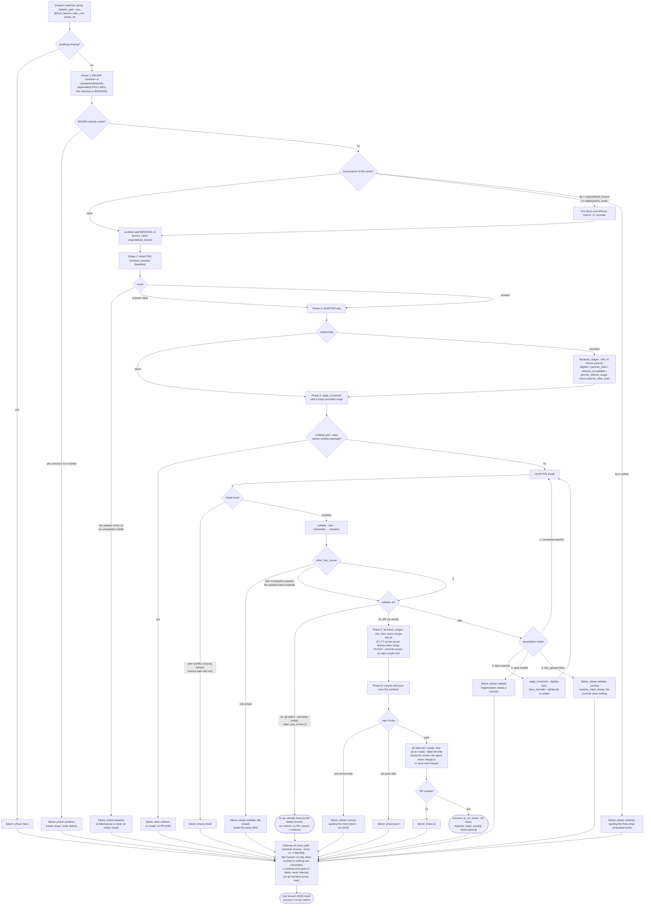
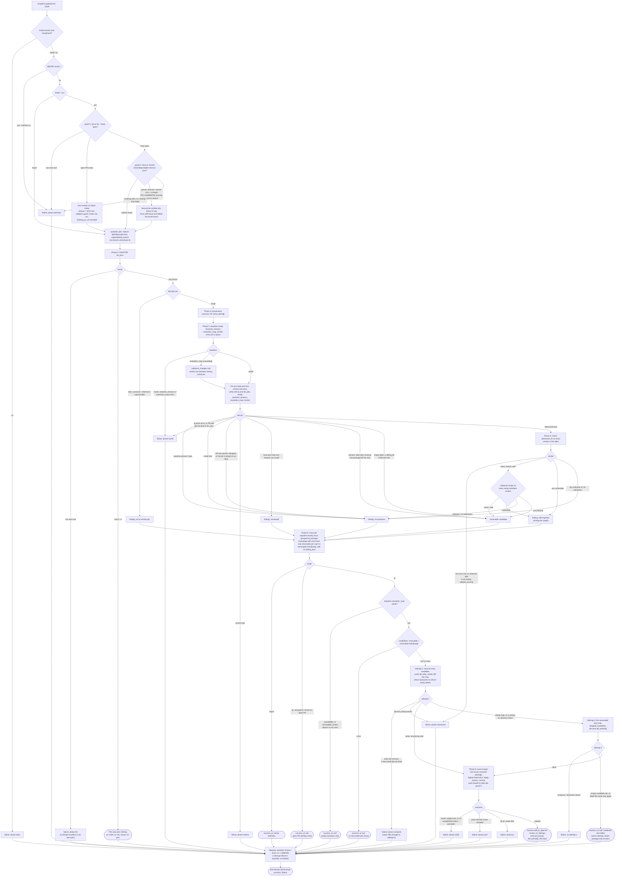

# resolve-alerts state flow

Every state the `resolve-alerts` skill and its two subagents can reach, and every branch between
them. The skill is the source of truth; this is a map of it, kept beside it rather than inside it
because the phase prose is written to be executed in order and a reader tracing "where can this
stop?" needs the shape instead.

Sources, in the order the flow reads them:

| File | Role here |
|---|---|
| [`plugins/gh-security/commands/resolve-alerts.md`](../../plugins/gh-security/commands/resolve-alerts.md) | Entry point; runs the skill from phase 1. |
| [`plugins/gh-security/commands/fix-alert.md`](../../plugins/gh-security/commands/fix-alert.md) | Deprecation shim, scheduled for removal; same flow with phase 3's *question* skipped and its answer pre-supplied as **One**. The ranked table is still presented. Delete its node from diagram 1 when the shim goes. |
| [`plugins/gh-security/skills/resolve-alerts/SKILL.md`](../../plugins/gh-security/skills/resolve-alerts/SKILL.md) | The orchestrator's phases, diagram 1. |
| [`plugins/gh-security/agents/fix-dependency.md`](../../plugins/gh-security/agents/fix-dependency.md) | One group's fix, diagram 2. |
| [`plugins/gh-security/agents/audit-pins.md`](../../plugins/gh-security/agents/audit-pins.md) | The pin audit that rides along, diagram 3. |

Three diagrams rather than one: the orchestrator and the two agents are separate control flows that
meet only at a dispatch payload and a JSON result block, and the agents cannot ask the user
anything, so where they stop is a different question from where the orchestrator does.

## Diagram 1: the orchestrator

Rounded nodes end the run. Diamonds are branches; diamonds labelled **ask** are where the user
decides, and nothing dispatches without one. The ask sites are phase 3's how-much, phase 4's batch
approval, and both of phase 8's offers: the next batch and the pin audit.

**No ask is about a pull request that already exists.** Phase 4 is the last one that gates a fix PR
into being, and phase 8's two offers dispatch further work — a next batch, or an audit that may
open a removal PR of its own — rather than deciding anything about a PR already on the page. PRs
open ready for review and no phase acts on one afterwards ([ADR
008](../adr/008-prs-open-ready-for-review.md)).

Two branches exclude one repo's groups without ending the run; they are drawn as plain nodes for
that reason.

```mermaid
flowchart TD
    START["/gh-security:resolve-alerts, or a natural-language ask"] --> P1
    SHIM["/gh-security:fix-alert (deprecated shim):<br/>print notice, pre-supply phase 3 = One,<br/>still present the ranked table"] --> P1

    P1["Phase 1: detect-scope.sh"] --> P1Q{"scope, or the user's own<br/>if the request names a different one"}
    P1Q -->|repo| P1R{"git_remote agrees with nwo?"}
    P1Q -->|"org / user"| P2
    P1R -->|no| P1RT["Trust git_remote, say so"] --> P1D
    P1R -->|yes| P1D{"default_branch resolved?"}
    P1D -->|null| STOP1(["Stop: origin's default branch<br/>could not be resolved"])
    P1D -->|yes| P2

    P2["Phase 2: discover-alerts.sh | select-adapter.sh"] --> P2REP["Report every skipped_repos entry by name,<br/>every time it is non-empty"]
    P2REP --> P2Q{"actionable groups?"}
    P2Q -->|none| STOP2(["Stop: report every skipped group<br/>and skipped repo"])
    P2Q -->|"one or more"| P3

    P3["Phase 3: ranked table<br/>(Repo column at org/user scope only)"] --> P3ASK{"ask: how much to fix?<br/>(pre-supplied as One on the shim path)"}
    P3ASK -->|One| P4
    P3ASK -->|"Highest tier"| P4
    P3ASK -->|Everything| P4

    P4["Phase 4: detect-capacity.sh, present the plan"] --> P4Q{"batch groups < cap?"}
    P4Q -->|"yes, spare slot"| P4ASK1{"ask: approve batch + audit mode"}
    P4Q -->|"no, cap full"| P4ASK2{"ask: approve batch<br/>(audit deferred to phase 8)"}
    P4ASK1 -->|"approve, audit mode: pr"| P4OK
    P4ASK1 -->|"approve, audit mode: report"| P4OK
    P4ASK1 -->|decline| STOP3(["Stop: nothing dispatched"])
    P4ASK2 -->|approve| P4OK
    P4ASK2 -->|decline| STOP3
    P4OK["Batch approved"] --> P5Q{"scope"}

    P5Q -->|repo| P6
    P5Q -->|"org / user"| P5["Phase 5: per distinct repo in the batch"]
    P5 --> P5A{"checkout at the conventional path?"}
    P5A -->|"git repo exists"| P5F["git -C fetch origin"] --> P5B
    P5A -->|"nothing there"| P5C["gh repo clone into the @owner convention"] --> P5B
    P5A -->|"wrong remote / not a repo"| P5X["Report the conflict, exclude that repo's<br/>groups; the other repos continue"]
    P5B{"detect-scope.sh default_branch?"}
    P5B -->|null| P5Y["Report that repo blocked, exclude its<br/>groups; the other repos continue"]
    P5B -->|yes| P6
    P5X --> P6
    P5Y --> P6

    P6["Phase 6: ensure-worktree-exclude.sh once per repo<br/>(failure non-fatal, dispatch anyway)"] --> P6W["Dispatch a wave: at most cap Task calls in one<br/>message, one fix-dependency per group,<br/>across every repo"]
    P6W --> P6A{"audit approved in phase 4?"}
    P6A -->|"yes, first wave only,<br/>counting against cap"| P6AD["audit-pins in the same message,<br/>mode passed verbatim, one repo"]
    P6A -->|no| P6BAR
    P6AD --> P6BAR["Wave barrier: wait for every agent"]
    P6BAR --> P6Q{"batch exhausted?"}
    P6Q -->|"no: next wave"| P6W
    P6Q -->|yes| P7

    P7["Phase 7: parse each fenced JSON result"] --> P7Q{"per result"}
    P7Q -->|success| P7S["Fix table row: PR, risk, F4/F5, bare-override note"]
    P7Q -->|"no-op"| P7N["Its own 'already fixed' line,<br/>never the failure list"]
    P7Q -->|failure| P7F["Failure list: phase + detail"]
    P7Q -->|"missing or unparseable block"| P7U["Recorded as a failure; never guess fields"]
    P7S --> P7AGG
    P7N --> P7AGG
    P7F --> P7AGG
    P7U --> P7AGG
    P7AGG["requires_major_bump[] first, then unaddressed skipped_repos,<br/>then deduplicated observations split by type"] --> P7AU{"audit ran in phase 6?"}
    P7AU -->|no| P8
    P7AU -->|yes| P7AR["Findings grouped per package, below and separate from<br/>the fix table; then the audit's own PR or its<br/>pr_skipped_reason; failure reported with the others"]
    P7AR --> P8

    P8{"Phase 8: actionable groups remain?"}
    P8 -->|yes| P8ASK0{"ask: dispatch the next batch?"}
    P8ASK0 -->|yes| P3
    P8ASK0 -->|no| P8A
    P8 -->|no| P8A{"audit already ran in phase 6?"}
    P8A -->|yes| P8REP
    P8A -->|no| P8ASK{"ask: run the pin audit?<br/>pr mode first, or report"}
    P8ASK -->|"pr / report"| P8D["Dispatch audit-pins, one per accepted repo,<br/>in waves under cap; report per phase 7"]
    P8D --> P8REP
    P8ASK -->|decline| P8REP
    P8REP["pr-status.sh on every success PR plus the audit's<br/>when one exists: checks, merge_state, auto_merge.<br/>Reported as information, never as a prompt"]
    P8REP --> DONE
    DONE(["Done: every PR URL with its band and check state,<br/>remaining skipped_repos, and what would unblock each"])
```

Two cycles, and no others. The wave loop (`P6Q` back to `P6W`) is the concurrency cap enforced as a
barrier. The next-batch loop (phase 8 to phase 3) is reached only when groups remain *and* the user
accepts the offer, and it re-enters the how-much question with what is left. There is no third:
phase 8's audit dispatch used to loop back into the promotion phase, and with that phase gone the
audit's PR is reported like any other and the flow runs straight to the end.

The audit offer is not conditional on the batch being finished. Phase 8 offers the next batch and
*then* recommends the audit unless one already ran in phase 6, so declining the next batch still
reaches the recommendation. Both offers precede the closing report, which is the last thing the run
does and asks nothing.

## Diagram 2: fix-dependency, one group

One agent per group, where a group is one major line of one package in one repo. It never asks
anything: every place the interactive flow would ask, it cleans up and returns a failure. Cleanup
runs on every path, success and failure alike, which is why the terminal states below are results
rather than exits.

`requires_major_bump[]` is not a state of its own. It rides on a `success` result, with its own
PR-body section, and it is also what rung 4's failure names when the group's line was never
installed. Either way the orchestrator re-reports it in phase 7; copies below the group's line
cannot be fixed from here and are never attempted.

Two things in this diagram follow the source's prose where its own schema disagrees, and are worth
fixing in the agent definition rather than here
([#89](https://github.com/SurveyMonkey/skills/issues/89)): a commit-hook failure is `phase commit`
in the prose while `commit` is absent from the result enum, and the inline comment beside
`apply_constraint` still says to pass `parents_read` "and only those", which the eligible-set rule
above it contradicts.

## Diagram 3: audit-pins

Dispatched with the repo (`nwo` in the agent's own input contract, `repo` in the orchestrator's
payload and in the result), `repo_root`, `default_branch`, an `adapter_path`, `scripts_dir`, and a
`mode` that the user decides in phase 4 or 8 and that is never defaulted. In `pr` mode the
distinction that matters is between a *failure* and one of the five ways a completed audit declines
to open a PR: both leave `pr` null, and only the first is a broken run.

`pr_skipped_reason` carries **one** value chosen by precedence, not by which node was drawn last:
`open PR already exists` first, then `no pins` or `no removable pins found`, then whatever the last
attempt that ran ended with (`partial resolution map` or `combined test failed`). A second reason
that also applied travels in `pr_skipped_detail`, along with the attempt number, since there is no
`pr.attempt` to read when `pr` is null. So the `no pins` node above carries that reason only when
guard 1 found no open PR.

Guard 1 is the one branch that changes what the audit may do at the end rather than where it goes:
the findings are produced either way, and only phases 7 and 8 are skipped. Guard 2 is the opposite,
and is why phase 8 is allowed to force-push and delete a local branch at all: without a proven
remnant it pushes plainly, and anything it cannot prove ends the run.

## Where the flow can stop

Run outcomes for the orchestrator:

| Terminal state | Reached from | What the user sees |
|---|---|---|
| Unresolvable default branch | Phase 1, repo scope | Stop before discovery |
| No actionable groups | Phase 2 | Every skipped group and skipped repo, by name |
| Batch declined | Phase 4 | Nothing dispatched; no agent ever ran |
| Done | Phase 8 | Every PR URL with its band and check state, remaining skipped repos, what unblocks each |

Everything else is per repo, and the run continues past it: a phase 5 checkout conflict or
unresolvable default branch excludes that repo's groups only. Nothing about a PR can withhold
anything any more — there is no offer left to withhold, so a red check is reported and the run ends
normally.

Agent results are the other terminals: `success`, `no-op` or `failure` from a fix agent, `success`
or `failure` from the audit. The three easiest to misread as each other are a fix agent's `failure`,
its `no-op`, and an audit's null `pr`. `no-op` is a clean outcome the orchestrator reports on its own
line. A `pr`-mode audit that succeeded with a null `pr` and one of the five reasons is a completed
audit. A `pr`-mode **success** with a null `pr` and no reason is the contract violation, to report as
a failure of the agent; a null `pr` on a `failure` result is not, because there the phase and detail
carry the story.
