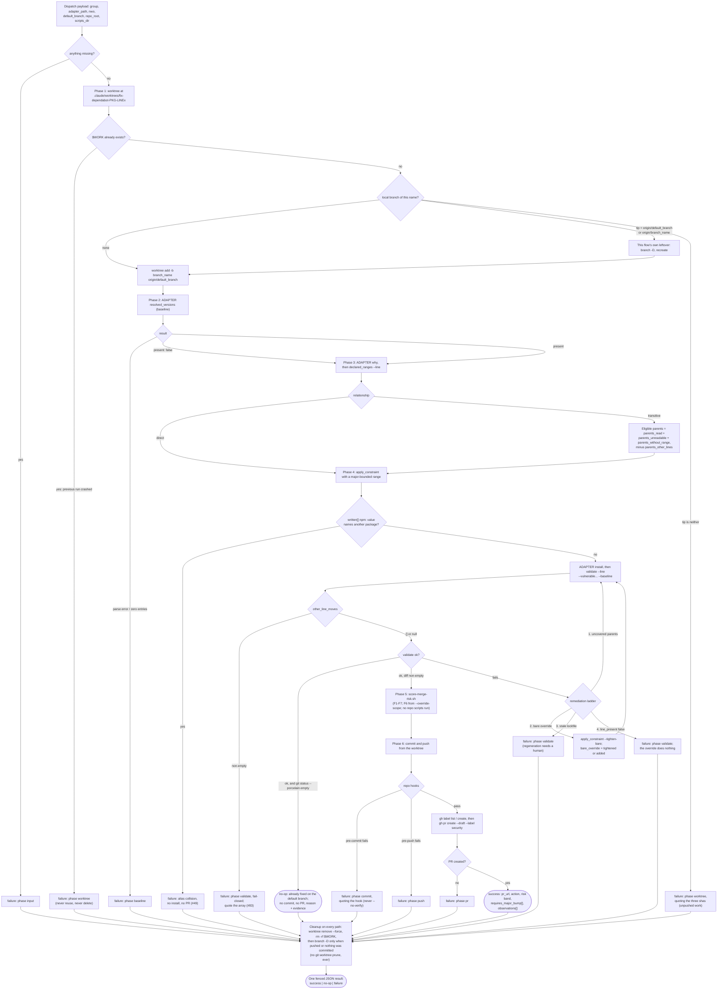
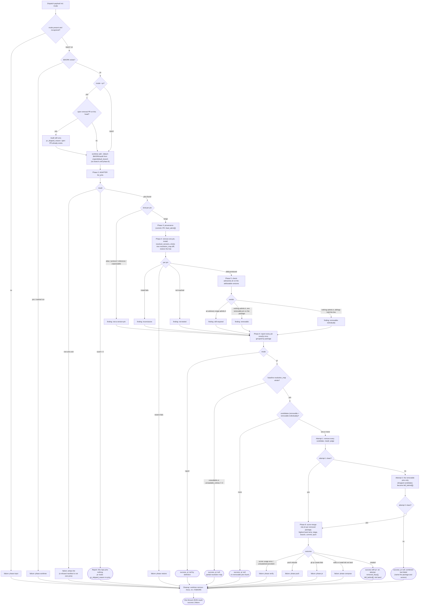

# resolve-alerts state flow

Every state the `resolve-alerts` skill and its two subagents can reach, and every branch between
them. The skill is the source of truth; this is a map of it, kept beside it rather than inside it
because the phase prose is written to be executed in order and a reader tracing "where can this
stop?" needs the shape instead.

Sources, in the order the flow reads them:

| File | Role here |
|---|---|
| [`plugins/gh-security/commands/resolve-alerts.md`](../../plugins/gh-security/commands/resolve-alerts.md) | Entry point; runs the skill from phase 1. |
| [`plugins/gh-security/commands/fix-alert.md`](../../plugins/gh-security/commands/fix-alert.md) | Deprecation shim; same flow with phase 4's answer pre-supplied as **One**. |
| [`plugins/gh-security/skills/resolve-alerts/SKILL.md`](../../plugins/gh-security/skills/resolve-alerts/SKILL.md) | Phases 1 through 11, diagram 1. |
| [`plugins/gh-security/agents/fix-dependency.md`](../../plugins/gh-security/agents/fix-dependency.md) | One group's fix, diagram 2. |
| [`plugins/gh-security/agents/audit-pins.md`](../../plugins/gh-security/agents/audit-pins.md) | The pin audit that rides along, diagram 3. |

Three diagrams rather than one: the orchestrator and the two agents are separate control flows that
meet only at a dispatch payload and a JSON result block, and the agents cannot ask the user
anything, so where they stop is a different question from where the orchestrator does.

## Diagram 1: the orchestrator, phases 1 to 11

Rounded nodes are terminal. Diamonds are branches the flow decides; diamonds labelled **ask** are
the four places the user decides (preflight consent, phase 4's how-much, phase 5's one batch
approval, phase 9's promotion), and nothing dispatches or leaves draft without one.

```mermaid
flowchart TD
    START["/gh-security:resolve-alerts, or a natural-language ask"] --> P1
    SHIM["/gh-security:fix-alert (deprecated shim):<br/>print notice, pre-supply phase 4 = One"] --> P1

    P1["Phase 1: detect-scope.sh"] --> P1Q{"scope"}
    P1Q -->|"user names a different scope"| P1OV["Use the user's scope, say so"]
    P1OV --> P1Q
    P1Q -->|repo| P1R{"git_remote agrees with nwo?"}
    P1Q -->|"org / user"| P3
    P1R -->|no| P1RT["Trust git_remote, say so"] --> P1D
    P1R -->|yes| P1D{"default_branch resolved?"}
    P1D -->|null| STOP1(["Stop: origin's default branch<br/>could not be resolved"])
    P1D -->|yes| P2

    P2["Phase 2: preflight-permissions.sh check<br/>(repo scope only)"] --> P2Q{"result"}
    P2Q -->|"script error"| P2SKIP["Report, skip preflight, continue<br/>(the one non-fatal script failure)"] --> P3
    P2Q -->|"nothing missing"| P3
    P2Q -->|"rules missing"| P2ASK{"ask: add the enumerated rules?"}
    P2ASK -->|"add them"| P2APPLY["preflight-permissions.sh apply,<br/>report what was added"] --> P3
    P2ASK -->|"continue without"| P3

    P3["Phase 3: discover-alerts.sh | select-adapter.sh"] --> P3REP["Report every skipped_repos entry by name,<br/>every time it is non-empty"]
    P3REP --> P3Q{"actionable groups?"}
    P3Q -->|none| STOP2(["Stop: report every skipped group<br/>and skipped repo"])
    P3Q -->|"one or more"| P4

    P4["Phase 4: ranked table<br/>(Repo column at org/user scope only)"] --> P4ASK{"ask: how much to fix?"}
    P4ASK -->|One| P5
    P4ASK -->|"Highest tier"| P5
    P4ASK -->|Everything| P5

    P5["Phase 5: detect-capacity.sh, present the plan"] --> P5Q{"batch groups < cap?"}
    P5Q -->|"yes, spare slot"| P5ASK1{"ask: approve batch + audit mode"}
    P5Q -->|"no, cap full"| P5ASK2{"ask: approve batch<br/>(audit deferred to phase 11)"}
    P5ASK1 -->|"approve, audit mode: pr"| P5OK
    P5ASK1 -->|"approve, audit mode: report"| P5OK
    P5ASK1 -->|decline| STOP3(["Stop: nothing dispatched"])
    P5ASK2 -->|approve| P5OK
    P5ASK2 -->|decline| STOP3
    P5OK["Batch approved"] --> P6Q{"scope"}

    P6Q -->|repo| P7
    P6Q -->|"org / user"| P6["Phase 6: per distinct repo in the batch"]
    P6 --> P6A{"checkout at the conventional path?"}
    P6A -->|"git repo exists"| P6F["git -C fetch origin"] --> P6B
    P6A -->|"nothing there"| P6C["gh repo clone into the @owner convention"] --> P6B
    P6A -->|"wrong remote / not a repo"| P6X(["Report the conflict,<br/>exclude that repo's groups"])
    P6B{"detect-scope.sh default_branch?"}
    P6B -->|null| P6Y(["Report that repo blocked,<br/>exclude its groups"])
    P6B -->|yes| P6P["preflight-permissions.sh check/apply<br/>for this repo (failure non-fatal)"]
    P6P --> P7

    P7["Phase 7: ensure-worktree-exclude.sh once per repo<br/>(failure non-fatal, dispatch anyway)"] --> P7W["Dispatch a wave: up to cap Task calls in one message,<br/>one fix-dependency per group, across every repo"]
    P7W --> P7A{"audit approved in phase 5?"}
    P7A -->|"yes, first wave only"| P7AD["audit-pins in the same message,<br/>mode passed verbatim, one repo"]
    P7A -->|no| P7BAR
    P7AD --> P7BAR["Wave barrier: wait for every agent"]
    P7BAR --> P7Q{"batch exhausted?"}
    P7Q -->|no| P7W
    P7Q -->|yes| P8

    P8["Phase 8: parse each fenced JSON result"] --> P8Q{"per result"}
    P8Q -->|success| P8S["Fix table row: PR, risk, F4/F5, bare-override note"]
    P8Q -->|"no-op"| P8N["Its own 'already fixed' line,<br/>never the failure list"]
    P8Q -->|failure| P8F["Failure list: phase + detail"]
    P8Q -->|"missing or unparseable block"| P8U["Recorded as a failure; never guess fields"]
    P8S --> P8AGG
    P8N --> P8AGG
    P8F --> P8AGG
    P8U --> P8AGG
    P8AGG["requires_major_bump[] first, then unaddressed skipped_repos,<br/>then deduplicated observations split by type"] --> P8AU{"audit ran in phase 7?"}
    P8AU -->|no| P9
    P8AU -->|yes| P8AR["Findings grouped per package, below and separate from<br/>the fix table; then the audit's own PR or its<br/>pr_skipped_reason; failure reported with the others"]
    P8AR --> P9

    P9["Phase 9: mark-ready.sh status on every success PR<br/>plus the audit's PR when one exists"] --> P9Q{"checks rollup"}
    P9Q -->|failed| P9F(["Not offered; list failing_checks"])
    P9Q -->|"none / pending"| P9P["Offerable, flagged honestly<br/>(none: promoting starts CI; pending: cite check_counts)"]
    P9Q -->|passed| P9OK["Offerable; provisional on a fresh PR<br/>or one reporting fewer checks than its siblings"]
    P9P --> P9AM{"auto_merge.armed?"}
    P9OK --> P9AM
    P9AM -->|"yes: promoting merges it"| P9ASK1{"ask: per-PR confirmation,<br/>re-run status first"}
    P9AM -->|no| P9ASK2{"ask: one batch confirmation"}
    P9ASK1 -->|approved| P10
    P9ASK1 -->|declined| P11
    P9ASK2 -->|"approved subset"| P10
    P9ASK2 -->|declined| P11

    P10["Phase 10: mark-ready.sh promote (approved URLs only)"] --> P10Q{"per PR"}
    P10Q -->|"rebased, marked ready"| P11
    P10Q -->|conflict| P10C["Report; recommend regeneration<br/>(close, delete branch, re-run) over hand-resolution"] --> P11
    P10Q -->|error| P10E["Report the error"] --> P11

    P11{"Phase 11: actionable groups remain?"}
    P11 -->|"yes (One or a tier was chosen)"| P4
    P11 -->|no| P11A{"audit already ran in phase 7?"}
    P11A -->|yes| DONE
    P11A -->|no| P11ASK{"ask: run the pin audit?<br/>pr mode first, or report"}
    P11ASK -->|"pr / report"| P11D["Dispatch audit-pins, one per accepted repo,<br/>in waves under cap; report per phase 8;<br/>its PR goes through phase 9"]
    P11D --> P9
    P11ASK -->|decline| DONE
    DONE(["Done: not-promoted PRs, remaining skipped_repos,<br/>and what would unblock each"])
```

Two loops are worth naming because they are the only cycles above. Phase 11 back to phase 4 is the
next-batch loop, reached only when the user chose One or a tier, and it re-enters the how-much
question with the remaining groups. Phase 11's audit dispatch back into phase 9 is the second: an
audit accepted after the fixes still has its draft PR gated by the same promotion flow.

## Diagram 2: fix-dependency, one group

One agent per group, where a group is one major line of one package in one repo. It never asks
anything: every place the interactive flow would ask, it cleans up and returns a failure. Cleanup
runs on every path, success and failure alike, which is why the terminal states below are results
rather than exits.

`requires_major_bump[]` is not a state: it is carried on a `success` result, with its own PR-body
section, and the orchestrator re-reports it in phase 8. Copies below the group's line cannot be
fixed from here and are never attempted.

## Diagram 3: audit-pins

Dispatched with a `{repo, repo_root, default_branch}` triple, an `adapter_path`, `scripts_dir`, and
a `mode` that is decided by the user in phase 5 or 11 and never defaulted. In `pr` mode the
distinction that matters is between a *failure* and one of the five ways a completed audit declines
to open a PR: both leave `pr` null, and only the first is a broken run.

The open-PR guard is the one branch above that does not change where the audit goes, only what it
may do at the end: the findings are produced either way, and `pr_skipped_reason` carries
`open PR already exists` with the existing URL. Its precedence against the other four reasons is
phase 7's, and a second reason that also applied travels in `pr_skipped_detail`.

## Where the flow can stop, in one place

| Terminal state | Reached from | What the user sees |
|---|---|---|
| Unresolvable default branch | Phase 1, repo scope | Stop before discovery |
| No actionable groups | Phase 3 | Every skipped group and skipped repo, by name |
| Batch declined | Phase 5 | Nothing dispatched; no agent ever ran |
| Repo excluded | Phase 6 | Checkout conflict, or an unresolvable default branch, per repo |
| Batch summarized, nothing promotable | Phase 8 into 9 | `no-op` and `failure` results carry no PR |
| Promotion declined or not offered | Phase 9 | Failing checks listed; drafts left as drafts |
| Conflicted promotion | Phase 10 | Regeneration recommended over hand-resolution |
| Done | Phase 11 | Not-promoted PRs, remaining skipped repos, what unblocks each |

The three that are easiest to misread as each other are a fix agent's `failure`, its `no-op`, and an
audit's `pr: null`. None of them is the other: `no-op` is a clean outcome the orchestrator reports
on its own line, and a `pr`-mode audit with a null `pr` and one of five reasons is a completed
audit, while a null `pr` with no reason is a contract violation to report as a failure of the agent.
