# audit-pins

| File | Role here |
|---|---|
| [`plugins/gh-security/skills/audit-pins/SKILL.md`](../../../../plugins/gh-security/skills/audit-pins/SKILL.md) | The standalone audit entry point, including its open-security-PR preflight. |
| [`plugins/gh-security/agents/audit-pins.md`](../../../../plugins/gh-security/agents/audit-pins.md) | The pin audit itself, dispatched only from that skill. |

**A boxed region is executed, not instructed.** Everything inside one runs as a tested script or
workflow — `common/fix-group.sh`, `common/audit-pins-driver.sh`, `workflows/fix-groups.mjs` — with
its branches decided in code and covered by the suite. Everything outside is prose a model reads
and follows, which is why the unboxed nodes are the ones that ask the user something, write PR
narrative, or apply judgment the driver deliberately hands back. The distinction is the point of
the drivers: a branch inside a box fails a test when it regresses, and a branch outside one is
only as reliable as the sentence describing it, so re-deriving a boxed procedure in agent prose is
a bug rather than a fallback (`docs/gh-security/GUIDE.md`).

The boxes hold the steps, not their verdicts. A driver's failure terminals sit outside its box on
purpose: the driver decides them, and the agent is what maps them onto a result block and reports
them.

Reached only through `/gh-security:audit-pins`, never through `resolve-alerts` ([#108](https://github.com/SurveyMonkey/skills/issues/108)).
The skill's own preflight — an open-PR check for the `security` label this plugin's own fix PRs
carry — runs before the mode question and before the agent is ever dispatched: an unmerged fix PR
may be adding or tightening an override the audit is about to judge removable, and the skill
stops rather than risk the inversion the field test's audit PR demonstrated. There is no
proceed-anyway path; a user who wants the audit to run anyway says so in conversation.

Once dispatched, the agent carries the repo (`nwo` in both the skill's dispatch payload and the
agent's own input contract; only the result renames it to `repo`), `repo_root`, `default_branch`, an `adapter_path`,
`scripts_dir`, an optional `env_prefix` resolved at the skill's step 1, and a `mode` that the
user decides at the skill's step 5 and that is never defaulted. In `pr` mode the distinction that matters is between a *failure* and one of the five
ways a completed audit declines to open a PR: both leave `pr` null, and only the first is a broken
run.

```mermaid
flowchart TD
    CMD1["/gh-security:audit-pins: detect-scope.sh,<br/>then resolve env_prefix from what session<br/>context states for this tree, if anything"] --> CMD1Q{"inside a git repository?"}
    CMD1Q -->|"no: scope null"| CMD1A["Ask which repo, or ask the user to run it from<br/>that repo's checkout, then re-run detect-scope.sh<br/>against that checkout and read the second output"] --> CMD1N
    CMD1Q -->|"yes: repo scope"| CMD1N{"nwo resolved from origin?"}
    CMD1N -->|null| CSTOPN(["Stop: the checkout has no usable origin;<br/>the removal PR has no repository to open against"])
    CMD1N -->|yes| CMD1D{"default_branch resolved?"}
    CMD1D -->|null| CSTOP0(["Stop: default_branch<br/>could not be resolved"])
    CMD1D -->|yes| CMD2{"manifest present?"}
    CMD2 -->|no| CSTOP1(["Stop: nothing this skill can audit"])
    CMD2 -->|yes| CMD3["select-adapter.sh"]
    CMD3 --> CMD4{"open security-labeled PRs?<br/>env_prefix gh pr list --label security --state open"}
    CMD4 -->|"one or more"| CSTOP2(["Stop: report each PR by number and title;<br/>merge or close first, no proceed-anyway (#108)"])
    CMD4 -->|none| CMD5["ensure-worktree-exclude.sh"]
    CMD5 --> CMD6{"ask: mode?"}
    CMD6 -->|"pr / report"| A0

    A0["Dispatch payload incl. mode"] --> A0Q{"mode present and recognized?"}
    A0Q -->|no| AFIN["failure: phase input"]
    A0Q -->|"report / pr"| A1{"$WORK exists?"}
    A1 -->|"yes: crashed run"| AFWT["failure: phase worktree"]
    A1 -->|no| A1B{"mode = pr?"}
    A1B -->|report| A1C
    A1B -->|yes| A1G{"guard 1: gh pr list --head, open?"}
    A1G -->|"non-zero exit"| AFWT
    A1G -->|"open PR exists"| APR1["Run exactly as report mode;<br/>phases 7 and 8 are skipped, guard 2 does not run.<br/>existing_pr_url recorded"]
    A1G -->|"none open"| A1R{"guard 2: local or remote<br/>chore/dependabot-remove-pins?"}
    A1R -->|"neither exists"| A1C
    A1R -->|"proven remnant: remote sha = a closed<br/>PR's headRefOid, local tip equal or absent"| A1RM["Record the verified sha; phase 8 may<br/>force-with-lease and delete the local branch"] --> A1C
    A1R -->|"anything else, or a lookup that failed"| AFWT
    A1C["worktree add --detach $WORK/audit from origin/default_branch<br/>(no branch until phase 8)"] --> A2
    APR1 --> A1C

    A2["Phase 2: ADAPTER list_pins"] --> A2Q{"result"}
    A2Q -->|"non-zero exit"| AFL["failure: phase list<br/>(a refused manifest is not zero pins)"]
    A2Q -->|"count = 0"| APINS(["This repo pins nothing.<br/>pr mode: pr null, reason no pins"])
    A2Q -->|"pins found"| A2K{"kind per pin"}
    A2K -->|"alias / protocol / reference / unparseable"| ANV["finding: not-a-version-pin"]
    A2K -->|range| A3["Phase 3: provenance (commit, PR, fixed_alerts[])"]

    A3 --> A4B["Phase 4: baseline install, resolved_versions,<br/>resolution_map, all with every pin in place"]
    A4B --> A4BQ{"baseline"}
    A4BQ -->|"install, resolved_versions or<br/>resolution_map errors"| AFI["failure: phase install"]
    A4BQ -->|"resolution_map unavailable"| A4NC["collateral_changes null,<br/>verdict not-checked; testing continues"] --> A4
    A4BQ -->|whole| A4
    A4["Per pin, bare pins first: remove the entry,<br/>verify with jq and list_pins, install,<br/>resolved_versions, resolution_map, restore"]
    A4 --> A4Q{"per pin"}
    A4Q -->|"baseline present: false"| AINC["finding: inconclusive"]
    A4Q -->|"jq parse error, or the edit<br/>did not land in list_pins"| AFI
    A4Q -->|"install fails"| AINC
    A4Q -->|"the two parsers disagree,<br/>or the pin is keyed on an alias"| AINC
    A4Q -->|"restore fails"| AFRES["failure: phase restore"]
    A4Q -->|"more pins than one session can install"| ANT["finding: not-tested"]
    A4Q -->|"present: false after removal:<br/>the package left the tree"| AREM["removable candidate"]
    A4Q -->|"empty delta: a sibling pin<br/>holds the tree"| AREM
    A4Q -->|"delta produced"| A5["Phase 5: check-advisories.sh on every<br/>version in the delta"]
    A5 --> A5Q{"verdict"}
    A5Q -->|"non-zero exit, or unknown with<br/>a non-empty adapter_errors[]"| AFA["failure: phase advisories"]
    A5Q -->|"every version safe"| A5C
    A5Q -->|"any vulnerable"| AREQ["finding: still-required,<br/>naming the ranges"]
    A5Q -->|"any unknown or no-advisories"| AINC
    A5C{"collateral verdict on<br/>every newly-admitted version"}
    A5C -->|"none / safe"| AREM
    A5C -->|vulnerable| AREQ
    A5C -->|"unknown / no-advisories"| AINC
    A5C -->|"not-checked"| AREM

    ANV --> A6
    AINC --> A6
    ANT --> A6
    AREQ --> A6
    AREM --> A6
    A6["Phase 6: every pin reported exactly once, grouped by package.<br/>A package with more than one removable pin: each is<br/>removable-individually, with its sibling_pins"] --> A6Q{"mode"}
    A6Q -->|report| ADONE(["success, pr null by definition"])
    A6Q -->|"pr, and guard 1 found an open PR"| APR1B(["success, pr null:<br/>open PR already exists"])
    A6Q -->|pr| A7{"baseline resolution_map whole?"}
    A7 -->|"unavailable, or unreadable_entries<br/>absent or non-zero"| APR2(["success, pr null:<br/>partial resolution map"])
    A7 -->|yes| A7C{"candidates: removable +<br/>removable-individually"}
    A7C -->|none| APR3(["success, pr null:<br/>no removable pins found"])
    A7C -->|"one or more"| A7A1["Attempt 1: remove every candidate,<br/>verify the edits, install, diff the map,<br/>check advisories on what it newly admits"]
    A7A1 --> A7Q{"attempt 1"}
    A7Q -->|"edits did not land,<br/>or the install did not finish"| AFC["failure: phase compose<br/>(never falls through to attempt 2)"]
    A7Q -->|"advisory lookup broke"| AFA
    A7Q -->|"clean: everything safe"| A8
    A7Q -->|"partial map, or a version<br/>no advisory clears"| A7A2["Attempt 2: the removable pins only;<br/>dropped candidates become left_behind[]"]
    A7A2 --> A7Q2{"attempt 2"}
    A7Q2 -->|"compose / advisories failure"| AFC2["failure, as attempt 1"]
    A7Q2 -->|"empty candidate set, or<br/>failed the same way again"| APR4(["success, pr null: combined test failed<br/>(which attempt, which package and version)"])
    A7Q2 -->|clean| A8

    A8["Phase 8: score-merge-risk.sh per removed package,<br/>highest band wins; stage, branch, commit,<br/>push leased or plain per guard 2"] --> A8Q{"outcome"}
    A8Q -->|"scorer usage error, or an<br/>unexplained status --porcelain"| AFV["failure: phase verify"]
    A8Q -->|"push refused, lease included"| AFP["failure: phase push"]
    A8Q -->|"gh pr create fails"| AFPR["failure: phase pr"]
    A8Q -->|created| APRD(["success with pr, open for review: url, attempt,<br/>removed_keys[], left_behind[], risk band"])

    AFIN --> ACL
    AFWT --> ACL
    AFL --> ACL
    AFI --> ACL
    AFRES --> ACL
    AFA --> ACL
    AFC --> ACL
    AFC2 --> ACL
    AFV --> ACL
    AFP --> ACL
    AFPR --> ACL
    APINS --> ACL
    ADONE --> ACL
    APR1B --> ACL
    APR2 --> ACL
    APR3 --> ACL
    APR4 --> ACL
    APRD --> ACL
    ACL["Cleanup: worktree remove --force, rm -rf $WORK;<br/>a cleanup failure is reported, not hidden"] --> ARES(["One fenced JSON result:<br/>success | failure"])

    subgraph APBOX["common/audit-pins-driver.sh — phases 2, 4 and 5"]
        A2
        A2Q
        A2K
        A4B
        A4BQ
        A4NC
        A4
        A4Q
        A5
        A5Q
        A5C
    end

    subgraph APTOG["common/audit-pins-driver.sh — phase 7, the together tests"]
        A7A1
        A7Q
        A7A2
        A7Q2
    end
```

`pr_skipped_reason` carries **one** value chosen by precedence, not by which node was drawn last:
`open PR already exists` first, then `no pins` or `no removable pins found`, then whatever the last
attempt that ran ended with (`partial resolution map` or `combined test failed`). A second reason
that also applied travels in `pr_skipped_detail`, along with the attempt number, since there is no
`pr.attempt` to read when `pr` is null. So the `no pins` node above carries that reason only when
guard 1 found no open PR.

Guard 1 is the one branch that changes what the audit may do at the end rather than where it goes:
the findings are produced either way, and only phases 7 and 8 are skipped. Guard 2 is the opposite,
and is why phase 8 is allowed to force-push and delete a local branch at all: without a proven
remnant it pushes plainly, and anything it cannot prove ends the run.

