# resolve-alerts: the orchestrator

Every state the `resolve-alerts` skill can reach, and every branch between them. The skill is the
source of truth; this is a map of it, kept outside the plugin because the phase prose is written
to be executed in order and a reader tracing "where can this stop?" needs the shape instead. The
fix agent it dispatches has its own flow, [fix-dependency-agent-flow.md](fix-dependency-agent-flow.md).

| File | Role here |
|---|---|
| [`plugins/gh-security/skills/resolve-alerts/SKILL.md`](../../../../plugins/gh-security/skills/resolve-alerts/SKILL.md) | The orchestrator's phases. |

**A boxed region is executed, not instructed.** Everything inside one runs as a tested script or
workflow — `common/fix-group.sh`, `common/audit-pins-driver.sh`, `workflows/fix-groups.mjs` — with
its branches decided in code and covered by the suite. Everything outside is prose a model reads
and follows, which is why the unboxed nodes are the ones that ask the user something, write PR
narrative, or apply judgment the driver deliberately hands back. The distinction is the point of
the drivers: a branch inside a box fails a test when it regresses, and a branch outside one is
only as reliable as the sentence describing it, so re-deriving a boxed procedure in agent prose is
a bug rather than a fallback (`docs/gh-security/GUIDE.md`).

The boxes hold the steps, not their verdicts. A driver's failure terminals sit outside its box on
purpose: the driver decides them, and the agent is what maps them onto a result block and reports
them.

Rounded nodes end the run. Diamonds are branches; diamonds labelled **ask** are where the user
decides, and nothing dispatches without one. The ask sites are phase 3's how-much, phase 4's batch
approval, and phase 8's offer of the groups declined at phase 3. Phase 1 asks nothing: scope is the
checkouts on disk, read by `discover-repos.sh`, and nothing is ever cloned
([ADR 011](../../../adr/011-scope-is-the-checkouts-on-disk.md)).

**No ask is about a pull request that already exists.** Phase 4 is the last one that gates a fix PR
into being, and phase 8's offer dispatches further work, the groups declined at phase 3, rather
than deciding anything about a PR already on the page. PRs
open ready for review and no phase acts on one afterwards ([ADR
008](../../../adr/008-prs-open-ready-for-review.md)). The pin audit is no longer part of this flow at
all ([issue #108](https://github.com/SurveyMonkey/skills/issues/108)): it is entered only via
`/gh-security:audit-pins` ([its flow](../audit-pins/_skill-flow.md)).

Three branches exclude a whole checkout's groups without ending the run: phase 1's unusable
checkouts (no `nwo` from origin, no resolvable default branch, or a branch-namespace probe that
failed twice), phase 2's pipeline failing for that checkout (a non-zero exit from
`discover-alerts.sh`, `select-adapter.sh` or `classify-lines.sh`), and phase 5's registry probe
failing twice for that repo, the adapter `detect` that resolves the probe's package manager
included. They are drawn as plain nodes for that reason, and the excluded checkout is reported by
name while the others carry on. Separately, `classify-lines.sh` withdraws individual groups
(`requires_major_bump`, `cross_line_collision`) without excluding their checkout; those are drawn at
`P2W` and `P2WC`. Everything that can withdraw a group now runs before the ranked table, so the
plan approved at phase 4 is final rather than provisional.

```mermaid
flowchart TD
    START["/gh-security:resolve-alerts, or a natural-language ask"] --> P1
    P1["Phase 1: discover-repos.sh"] --> P1F{"discover-repos.sh exit status"}
    P1F -->|"non-zero: a git failure, or a target that is<br/>unreadable or not a directory"| STOPD(["Stop: report the script's error;<br/>nothing is in scope"])
    P1F -->|zero| P1Q{"any checkout roots?"}
    P1Q -->|"none"| STOP0(["Stop: no git repositories<br/>directly inside the current directory"])
    P1Q -->|"one or more"| P1E["Per checkout root: env_prefix first, from what session context<br/>states for that tree, then detect-scope.sh for nwo and<br/>default_branch, then the ls-remote branch-namespace probe.<br/>The orchestrator's own gh/git/script calls for that repo<br/>run under its prefix from the start"]
    P1E --> P1R{"per root: nwo, default_branch<br/>and probe all usable?"}
    P1R -->|"null nwo, null default_branch,<br/>or the probe failed twice"| P1X["Reported by name and excluded;<br/>the other roots continue"]
    P1X --> P1S{"any root left?"}
    P1S -->|no| STOP1(["Stop: every checkout was excluded,<br/>each reported by name"])
    P1S -->|yes| P2
    P1R -->|yes| P2

    P2["Phase 2: per surviving checkout: discover-alerts.sh<br/>| select-adapter.sh | classify-lines.sh --base-ref"] --> P2F{"pipeline exit status<br/>for that checkout"}
    P2F -->|"non-zero from discover-alerts.sh,<br/>select-adapter.sh or classify-lines.sh"| P2FX["That checkout is reported by name and excluded;<br/>the other checkouts continue"] --> P7AGG
    P2F -->|zero| P2R{"classify-lines verdict<br/>per group, before the table"}
    P2R -->|requires_major_bump| P2W["Withdrawn before the plan is shown;<br/>reported in phase 7 with resolved_majors context"] --> P7AGG
    P2R -->|cross_line_collision| P2WC["Withdrawn before the plan is shown; reported in<br/>phase 7 under 'shared parent across major lines'<br/>with collision_parents"] --> P7AGG
    P2R -->|"remaining groups"| P2REP["Report every excluded checkout by name"]
    P2REP --> P2Q{"actionable groups?"}
    P2Q -->|none| STOP2(["Stop: report every skipped group<br/>and every excluded checkout"])
    P2Q -->|"one or more"| P3

    P3["Phase 3: ranked table<br/>(Repo column when more than one<br/>checkout is in scope)"] --> P3ASK{"ask: how much to fix?"}
    P3ASK -->|One| P4
    P3ASK -->|"Highest tier"| P4
    P3ASK -->|Everything| P4

    P4["Phase 4: detect-capacity.sh, present the plan"] --> P4ASK1{"ask: approve the batch?"}
    P4ASK1 -->|approve| P4OK
    P4ASK1 -->|decline| STOP3(["Stop: nothing dispatched"])
    P4OK["Batch approved"] --> P5

    P5["Phase 5: per distinct repo in the approved batch:<br/>ensure-worktree-exclude.sh before the first agent for that repo<br/>(failure non-fatal, dispatch anyway), then the registry probe"] --> P6P{"Registry probe per repo, from inside repo_root,<br/>under env_prefix: pm_exec view on a scoped dependency,<br/>or the top-ranked package; one retry"}
    P6P -->|"fails twice: auth 401/403, not-found 404,<br/>or network"| P6X["Exclude that repo's groups; reported in phase 7<br/>as possibly transient, re-running re-probes"] --> P7AGG
    P6P -->|green| P6Q["Phase 6 dispatch list: every approved group across<br/>every repo, in ranked order, one payload each"]
    P6Q --> P6D["One Workflow call, machine-wide: cap workers over the list,<br/>one fix-dependency agent per group, each result<br/>schema-validated against the agent Result contract"]
    P6D --> P6R["Per returned entry: one post-agent.sh call<br/>(PR verified, then reap or leave, always reported)"]
    P6R --> P7

    P7["Phase 7: read the workflow's returned entries"] --> P7Q{"per entry"}
    P7Q -->|success| P7S["Fix table row: PR, risk, F4/F5, bare-override note"]
    P7Q -->|"no-op"| P7N["Its own 'already fixed' line,<br/>never the failure list"]
    P7Q -->|failure| P7F["Failure list: phase + detail"]
    P7Q -->|"null result (schema unmet, or the agent died)"| P7U["Recorded as a failure; never guess fields"]
    P7S --> P7AGG
    P7N --> P7AGG
    P7F --> P7AGG
    P7U --> P7AGG
    P7AGG["requires_major_bump[] first, then the checkouts excluded<br/>in phases 1 and 2 and the registry-preflight exclusions,<br/>then the shared-parent-across-major-lines skips<br/>with their collision_parents,<br/>then what the reap removed and left,<br/>then deduplicated observations by type"] --> P8

    P8{"Phase 8: actionable groups remain?"}
    P8 -->|yes| P8ASK0{"ask: fix the groups declined at phase 3?"}
    P8ASK0 -->|yes| P3
    P8ASK0 -->|no| P8REP
    P8 -->|no| P8REP["Point at /gh-security:audit-pins as separate<br/>follow-up work, run once these fix PRs have<br/>landed (#108); pr-status.sh on every success PR:<br/>checks, merge_state, reported as information"]
    P8REP --> DONE
    DONE(["Done: every PR URL with its band and check state,<br/>every excluded checkout, and what would unblock each"])

    subgraph WFBOX["workflows/fix-groups.mjs — tested JavaScript, not model-executed prose"]
        P6D
    end
```

One cycle, and no others. The drain loop that used to sit at phase 6 is gone: the concurrency cap
is now held by the dispatch workflow's own workers (issue #175), so nothing in this flow counts
agents in flight or refills a slot, and a null result is a failure entry rather than a freed slot.
The declined-groups loop (phase 8 to phase 3) is reached only when groups
remain *and* the user accepts the offer, and it re-enters the how-much question with what is left;
those groups were never approved at phase 4, so it is a scope question rather than a resumption of
approved work. There is no third: this flow dispatches no other agent kind and asks no other
question.

Phase 8 has one offer, not two: the groups declined at phase 3. The pin audit is not part of this
run at all ([#108](https://github.com/SurveyMonkey/skills/issues/108)) — the closing report points
at `/gh-security:audit-pins` as separate follow-up work instead, run once this run's fix PRs have
landed, because the two flows edit the same overrides block and running them together produces
exactly the conflict a field case demonstrated
(the field test's audit PR).

## Where the flow can stop

Run outcomes for the orchestrator:

| Terminal state | Reached from | What the user sees |
|---|---|---|
| No usable `origin` on the checkout | Phase 1, repo scope | Stop before discovery; `nwo` has no other source |
| Unresolvable default branch | Phase 1, repo scope | Stop before discovery |
| No actionable groups | Phase 2 | Every skipped group and skipped repo, by name |
| Batch declined | Phase 4 | Nothing dispatched; no agent ever ran |
| Done | Phase 8 | Every PR URL with its band and check state, remaining skipped repos, what unblocks each |

Everything else is per repo, and the run continues past it: a phase 5 checkout conflict, an
unresolvable default branch, or a phase 6 registry probe that fails twice excludes that repo's
groups only. Nothing about a PR can withhold
anything any more — there is no offer left to withhold, so a red check is reported and the run ends
normally.

Agent results are the other terminals: `success`, `no-op` or `failure` from a fix agent, `success`
or `failure` from the audit. The three easiest to misread as each other are a fix agent's `failure`,
its `no-op`, and an audit's null `pr`. `no-op` is a clean outcome the orchestrator reports on its own
line. A `pr`-mode audit that succeeded with a null `pr` and one of the five reasons is a completed
audit. A `pr`-mode **success** with a null `pr` and no reason is the contract violation, to report as
a failure of the agent; a null `pr` on a `failure` result is not, because there the phase and detail
carry the story.
