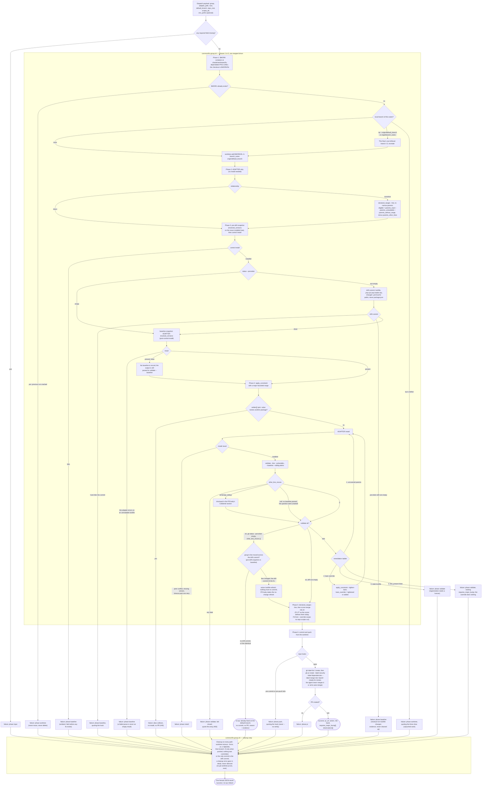

# resolve-alerts: the fix-dependency agent, one group

| File | Role here |
|---|---|
| [`plugins/gh-security/agents/fix-dependency.md`](../../../../plugins/gh-security/agents/fix-dependency.md) | One group's fix. |

**A boxed region is executed, not instructed.** Everything inside one runs as a tested script or
workflow — `common/fix-group.sh`, `common/audit-pins-driver.sh`, `workflows/fix-groups.mjs` — with
its branches decided in code and covered by the suite. Everything outside is prose a model reads
and follows, which is why the unboxed nodes are the ones that ask the user something, write PR
narrative, or apply judgment the driver deliberately hands back. The distinction is the point of
the drivers: a branch inside a box fails a test when it regresses, and a branch outside one is
only as reliable as the sentence describing it, so re-deriving a boxed procedure in agent prose is
a bug rather than a fallback (`docs/gh-security/GUIDE.md`).

The boxes hold the steps, not their verdicts. A driver's failure terminals sit outside its box on
purpose: the driver decides them, and the agent is what maps them onto a result block and reports
them.

One agent per group, where a group is one major line of one package in one repo. It never asks
anything: every place the interactive flow would ask, it cleans up and returns a failure. Cleanup
runs on every path, success and failure alike, which is why the terminal states below are results
rather than exits.

`requires_major_bump[]` is not a state of its own. It rides on a `success` result, with its own
PR-body section, and it is also what rung 4's failure names when the group's line was never
installed. Either way the orchestrator re-reports it in phase 7; copies below the group's line
cannot be fixed from here and are never attempted.

Both defects [#89](https://github.com/SurveyMonkey/skills/issues/89) named are fixed in the agent
definition: a commit-hook failure now reports `phase push`, matching the result enum's absence of a
`commit` phase, and the `apply_constraint` comment now matches the eligible-set rule (`parents_read`
plus `parents_unreadable` plus `parents_without_range`), fixed by
[#112](https://github.com/SurveyMonkey/skills/issues/112).

