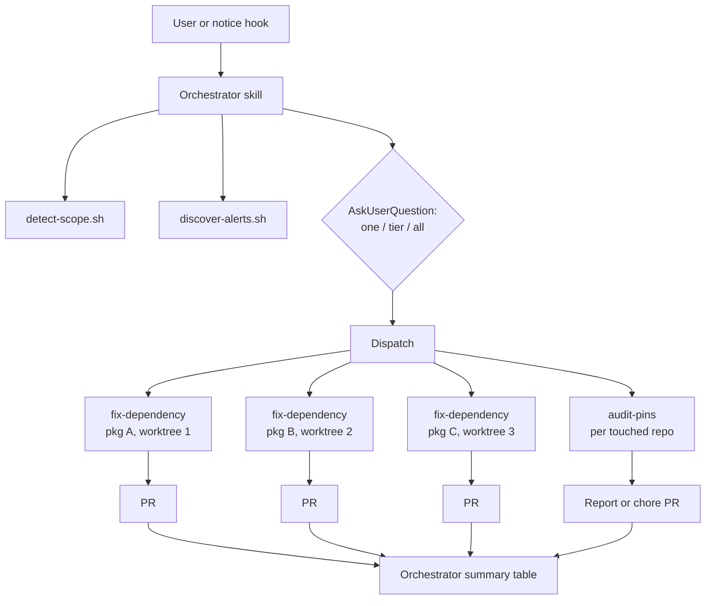

# RFC 001: Orchestrated Multi-Agent Security Alert Resolution

## Summary

Convert the `gh-security` plugin from a single-shot, one-package-per-invocation command into an orchestrated multi-agent workflow. An orchestrator skill discovers Dependabot alerts at repo, org, or user scope, asks the user how much to fix (one package, the highest severity tier, or everything), then spawns one fix subagent per vulnerable package in parallel, each working in an isolated git worktree through to an open PR. A separate audit subagent runs alongside to find previously pinned transitive dependencies whose pins are no longer needed. All deterministic work (alert discovery, scope detection, package manager detection, override insertion, lockfile validation) moves into scripts so agents consume structured JSON instead of re-deriving procedures each session, cutting token cost and variance and allowing subagents to run on a smaller model.

## Motivation

The current `/gh-security:fix-alert` command works well but resolves exactly one package group per invocation, with a developer driving each run interactively. A repo with six vulnerable packages needs six sequential sessions. An org with alerts across a dozen repos needs a developer to visit each repo and repeat the process. The work is highly repetitive: the judgment moments (is this direct or transitive, did the install break, is a script failure pre-existing) are small islands in an otherwise mechanical procedure.

Three specific gaps:

1. **No parallelism.** Fixes for independent packages do not conflict semantically, yet they run serially because a single session edits one `package.json` and one branch at a time.
2. **No scope above the repo.** GitHub exposes an org-level aggregate endpoint for Dependabot alerts, but the command only knows the current repo. Cross-repo cleanup requires manual repetition.
3. **No cleanup path.** Scoped overrides added to fix transitive alerts accumulate. When a direct dependency later updates past the vulnerable range, the pin becomes dead weight that can silently hold packages back. Nothing audits these today.

Additionally, the current command embeds deterministic procedures (package manager tables, lockfile grep patterns, override JSON shapes) as prose the model re-interprets every session. That is token cost and behavioral variance we can eliminate with scripts.

## Goals / Non-Goals

**Goals**

- One fix subagent per vulnerable package, runnable in parallel, each producing its own PR.
- An orchestrator that discovers alerts, checks existing PRs, asks the user for scope (one, tier, or all), and dispatches subagents.
- Org scope via the aggregate endpoint; user scope via deterministic per-repo fan-out.
- A pin-audit subagent that identifies removable overrides and resolutions.
- Deterministic work extracted to scripts with JSON output contracts.
- Model tiering: subagents pinned to a cheaper model; orchestrator guidance documented.
- Natural-language triggering via a skill description, with the slash command kept as an explicit entry point.
- A proactive nudge when the GitHub CLI surfaces a vulnerability notice mid-session.

**Non-Goals**

- Auto-merging PRs. A human reviews and merges every PR this system opens.
- Ecosystems beyond the JavaScript package managers already supported (pnpm, npm, yarn, bun). The architecture should not preclude others, but they are out of scope here.
- Scheduled or CI-driven execution (GitHub Actions, cron). This remains an interactive, developer-initiated tool.
- Replacing Dependabot's own update PRs. This tool covers what Dependabot cannot: scoped overrides for transitives, full repo script validation, and batch judgment.

## Proposed Approach

### Component overview

```
plugins/gh-security/
  .claude-plugin/plugin.json
  skills/
    resolve-alerts/
      SKILL.md              # orchestrator (replaces commands/fix-alert.md)
  agents/
    fix-dependency.md       # per-package fix subagent
    audit-pins.md           # override/resolution audit subagent
  commands/
    resolve-alerts.md       # thin wrapper: invokes the skill explicitly
  scripts/
    detect-scope.sh         # cwd -> {scope: repo|org|user, owner, repo?}
    detect-pm.sh            # lockfile -> {pm, why_cmd, install_cmd, override_field}
    discover-alerts.sh      # extended: --scope repo|org|user
    add-override.sh         # jq edit: insert scoped override into package.json
    validate-lockfile.sh    # per-PM grep: all resolved versions satisfy range
    list-pins.sh            # extract existing overrides/resolutions as JSON
  hooks/
    hooks.json
    notice-scan.sh          # PostToolUse: detect GitHub vulnerability notices
```



### Orchestrator skill

The orchestrator is a skill (`resolve-alerts`) that runs in the main session. Flow:

1. **Detect scope.** `detect-scope.sh` maps the working directory to repo, org, or user scope using the existing `@`-segment convention. The user can override by asking explicitly ("fix alerts across the whole org").
2. **Discover.** `discover-alerts.sh --scope <scope>` fetches, groups, ranks, and PR-checks alerts (see endpoint strategy below). Output is the existing `{actionable, skipped}` contract, with each group additionally carrying `repo` so cross-repo dispatch works.
3. **Ask.** Present the ranked table, then AskUserQuestion with three options:
   - **One**: fix only the top-ranked group (current behavior).
   - **Highest tier**: fix every group at the highest severity present. If no critical alerts exist, this means all high; if none, all medium, and so on.
   - **Everything**: fix all actionable groups.
4. **Approve once.** Show the dispatch plan (package, repo, severity, action type, branch) and get a single confirmation. This replaces the current per-run "ready to ship?" pause: subagents run unattended through PR creation, and the PR itself becomes the review artifact.
5. **Dispatch.** Spawn one `fix-dependency` subagent per group, each receiving the group JSON, the PM detection JSON, and repo metadata as its prompt payload. No subagent re-discovers anything. Concurrency is capped (proposed default: 3) to bound disk and install load.
6. **Audit.** Spawn one `audit-pins` subagent per repo touched (or per repo in scope), in parallel with the fixes.
7. **Summarize.** Collect results and present a table: package, repo, PR URL, resolved version, script results, plus audit findings.

### Scope and endpoint strategy

GitHub's aggregate endpoints are asymmetric, and the orchestrator must know this rather than guess:

| Scope | Endpoint strategy |
|---|---|
| Repo | `GET /repos/{owner}/{repo}/dependabot/alerts` (current behavior) |
| Org | `GET /orgs/{org}/dependabot/alerts` (single aggregate call, paginated) |
| User | No aggregate endpoint exists. Enumerate `GET /user/repos?type=owner`, skip forks and archived repos, then fan out per-repo alert calls inside the script |

All three live behind `discover-alerts.sh --scope`, so the orchestrator prompt never contains endpoint logic. The user fan-out stays inside one script invocation: dozens of repo calls happen in bash, not as dozens of agent tool calls.

At org and user scope, the script also records whether the authenticated user can push to each repo; repos without push access are reported but not dispatched.

### Fix subagent (`fix-dependency`)

Phases 4 through 9 of the current command, parameterized. Input: one package group JSON plus PM and repo metadata. The subagent:

1. Creates an isolated git worktree from the default branch and creates the fix branch there. Worktree isolation is what makes same-repo parallelism safe: two subagents editing the same `package.json` and lockfile cannot collide. Worktrees do not share installed dependencies, so each runs its own install (accepted cost, see Trade-offs).
2. Runs the "why" command to classify direct vs transitive and identify parents.
3. Applies the fix: direct version bump via Edit, or `add-override.sh` for transitives (major-bounded, parent-scoped, per the existing rules).
4. Installs, validates with `validate-lockfile.sh`, and runs every repo script (the one genuinely judgment-heavy step: diagnosing failures and distinguishing pre-existing breakage).
5. Commits, pushes, opens the PR with the existing body format, and returns a structured result (PR URL, resolved version, script outcomes, or a failure report).

A subagent that cannot complete safely (validation fails, scripts break in ways attributable to the update) stops, cleans up its worktree, and returns a failure report instead of asking the user mid-flight. The orchestrator surfaces failures in the summary for a human-driven follow-up session.

### Pin-audit subagent (`audit-pins`)

The common lifecycle this addresses: we pin a transitive dependency (override/resolution) because a direct dependency has not yet updated past a vulnerable range. Later the direct dependency updates, and the pin becomes unnecessary. Input: one repo. The subagent:

1. Runs `list-pins.sh` to extract every override/resolution entry with its scoping parent and range.
2. For each pin, gathers provenance: `git log -S` on the entry, linked PRs, and referenced alerts (including `state=fixed` Dependabot alerts for that package).
3. Tests removability in a scratch worktree: remove the pin, install, and check the naturally resolved version against the range the pin enforced. If resolution without the pin satisfies the safe range, the pin is removable.
4. Reports findings; in a later phase, opens a `chore(deps): remove stale overrides` PR through the same validate-and-run-scripts pipeline as the fix subagent.

Starting report-only keeps the blast radius small while we build confidence in step 3's correctness.

### Deterministic script extraction

Principle: **agents decide, scripts do.** Anything with one correct procedure becomes a script with a JSON contract. From the current command prose, that means:

| Current prose | Becomes | Notes |
|---|---|---|
| Phase 1 owner/repo derivation | `detect-scope.sh` | Also classifies repo/org/user |
| Phase 2 PM table | `detect-pm.sh` | Emits why/install commands and override field |
| Phase 3 | `discover-alerts.sh` | Already exists; gains `--scope` |
| Phase 6 override JSON shapes | `add-override.sh` | jq insertion; merges with existing entries; per-PM syntax (`parent>dep`, nested, `parent/dep`, flat for bun) |
| Phase 8b lockfile greps | `validate-lockfile.sh` | Exits non-zero with violating versions on failure |
| (new) pin extraction | `list-pins.sh` | For the audit subagent |

What stays with the agent: interpreting install failures, judging script failures as pre-existing or caused, deciding when a lockfile regeneration is warranted, and writing PR prose.

### Model selection

| Component | Model | Rationale |
|---|---|---|
| `fix-dependency` | `sonnet` (frontmatter pin) | With discovery, override insertion, and validation scripted, the remaining judgment (install failures, script triage) is well within Sonnet. Haiku was considered and rejected: debugging a broken install or a failing test suite is exactly where a too-small model produces confident nonsense. |
| `audit-pins` | `sonnet` | Same profile: scripted extraction, moderate judgment on provenance. |
| Orchestrator | inherits session model | Skills run in the main session and cannot pin a model. With dispatch scripted, the orchestrator is mostly presentation and routing; Sonnet is sufficient, and we document that in the skill. Opus adds nothing once the endpoint and ranking logic live in scripts. |

If experience shows the fix subagent is more mechanical than expected, dropping to Haiku is a one-line frontmatter change; starting at Sonnet is the safer default.

### Trigger mechanism

Two changes:

1. **Command to skill.** The orchestrator ships as `skills/resolve-alerts/SKILL.md` with a description written for model-triggered invocation ("resolve Dependabot security alerts", "fix security vulnerabilities in dependencies", "clean up npm audit findings"). A thin `commands/resolve-alerts.md` remains for explicit `/gh-security:resolve-alerts` invocation. `commands/fix-alert.md` is removed in the same release (pre-1.0, single known user base; a deprecation window adds maintenance for no benefit).
2. **Proactive notice hook.** The plugin ships a PostToolUse hook on Bash that scans tool output for GitHub's push-time vulnerability notice (`GitHub found N vulnerabilities on ...`) and Dependabot URLs in `gh` output. On match, it emits additional context telling Claude to offer the `resolve-alerts` skill and ask whether to start. The hook is a fast grep (exit 0 on no match, no network calls), so per-Bash-call overhead is negligible. It suggests; it never auto-runs.

## Alternatives Considered

- **Dependabot security updates / grouped PRs.** Dependabot can already open fix PRs for direct dependencies. It cannot add parent-scoped overrides for transitives (the majority of real alerts in practice), does not run the repo's own scripts before opening a PR, and its grouped updates are noisy in a way that costs review trust. This tool exists precisely for the gap Dependabot leaves.
- **Renovate.** Stronger than Dependabot on grouping and scheduling, but the same transitive-override gap applies, and introducing a third-party service is a bigger organizational lift than extending a tool already in use.
- **One large agent doing everything serially.** Simplest to build (the current command, looped). Rejected: context grows with every package, token cost scales superlinearly, one failure mid-loop strands the remainder, and wall-clock time is the sum rather than the max of package fix times.
- **GitHub Action instead of a Claude Code plugin.** Would enable scheduled runs, but loses the interactive judgment moments (scope choice, failure triage) that make the results trustworthy, and requires credential management this plugin gets for free from the developer's `gh` session. Could be a future layer on top, not the foundation.
- **Orchestrator as a pinned-model agent instead of a skill.** Would allow pinning the orchestrator's model, but subagent-spawning from within a subagent and AskUserQuestion interaction both fit poorly. The skill-in-main-session shape keeps the user conversation where it belongs.
- **Per-PR user approval (current behavior) retained in parallel mode.** Rejected: N subagents pausing for N confirmations serializes the human and defeats the parallelism. A single upfront batch approval plus PR review preserves control with one interaction.

## Trade-offs & Risks

- **Worktree install cost.** Each parallel subagent runs a full dependency install in its own worktree. For heavy repos this is minutes of wall clock and gigabytes of disk per concurrent fix. Mitigation: concurrency cap (default 3), and the caps are per-repo; cross-repo fixes do not compound on the same store. pnpm's content-addressable store softens this considerably for pnpm repos.
- **Batch approval reduces per-PR control.** The user approves a plan, not each commit. Mitigation: PRs are the review artifact, nothing merges automatically, and the summary table makes it easy to close any unwanted PR.
- **Duplicate-PR races.** Two sessions running concurrently could both dispatch the same package. The branch-existence check in discovery mitigates the common case; the residual race window is accepted (the second PR fails on branch push and reports cleanly).
- **Org endpoint permissions.** `GET /orgs/{org}/dependabot/alerts` requires org-level security visibility (security manager or admin). The script must detect a 403 and fall back to per-repo enumeration of repos the user can access, or report the limitation clearly.
- **Rate limits at user/org scope.** Fan-out over many repos plus per-package PR checks can burn REST quota. The script batches and paginates, but very large orgs may need a `--repo-limit` guard.
- **Pin-removal false positives.** The audit subagent declaring a pin removable when it still matters would reintroduce a vulnerability. Mitigation: report-only first phase; removal PRs re-run the full lockfile validation against the originally enforced range.
- **Hook noise.** A PostToolUse hook on every Bash call is a standing cost. The scan is a local grep with no network calls, and it emits context only on match, but it is one more moving part to keep silent when irrelevant.
- **Subagents cannot ask questions.** Failure modes that today get interactive resolution (lockfile regeneration confirmation) become stop-and-report. Some fixes that would have succeeded interactively will land in the failure column and need a follow-up session.

## Rollout / Migration Plan

Phases are sequential PRs, each leaving the plugin fully working. Versions follow the marketplace `version` field.

1. **Phase 1: script extraction (v0.2.0).** Add `detect-scope.sh`, `detect-pm.sh`, `add-override.sh`, `validate-lockfile.sh`. Rewrite `fix-alert.md` to consume them. Behavior identical to today; the command shrinks and the deterministic surface moves to scripts with tests run against real repos.
2. **Phase 2: subagent + orchestrator, repo scope (v0.3.0).** Add `agents/fix-dependency.md` and `skills/resolve-alerts/SKILL.md` with the one/tier/all question, worktree isolation, parallel dispatch, and batch approval. Remove `commands/fix-alert.md`, add thin `commands/resolve-alerts.md`. Update README and marketplace description.
3. **Phase 3: org and user scope (v0.4.0).** Extend `discover-alerts.sh` with `--scope`, add push-access filtering and the 403 fallback. Orchestrator gains cross-repo dispatch.
4. **Phase 4: pin audit (v0.5.0).** Add `list-pins.sh` and `agents/audit-pins.md`, report-only. Graduate to chore-PR mode in a subsequent minor once findings prove reliable.
5. **Phase 5: proactive hook (v0.6.0).** Add `hooks/hooks.json` and `notice-scan.sh`.

Each phase gets a GitHub issue before implementation; hard decisions made during a phase get an ADR linked back here.

## Open Questions

- Should subagent-opened PRs be drafts by default, converting to ready only after the orchestrator's summary, or ready immediately?
- Is 3 the right default concurrency cap, and should it be configurable per invocation?
- At org scope, should repos without push access get an issue filed instead of being silently skipped?
- Does the audit subagent need advisory-database cross-referencing (`gh api /advisories?affects=<pkg>`) beyond the repo's own fixed alerts to establish the safe range for a pin?
- Should the notice hook also match `npm audit` / `pnpm audit` output, or only GitHub-sourced notices?
- EMU accounts: the org endpoint behaves differently under enterprise managed users. Is EMU support in scope for Phase 3 or explicitly deferred?

## Decisions & Follow-ups

To be spawned as this RFC executes:

- ADR: batch approval model replacing per-PR confirmation.
- ADR: model tiering for subagents (and the Haiku re-evaluation criteria).
- ADR: worktree isolation strategy and concurrency cap.
- Issues: one per rollout phase, linked in `related_issues` as they are opened.
- Skill/rule graduation: the override-syntax rules (major-bounded ranges, parent scoping) are already durable guidance; they move from command prose into `add-override.sh` and the subagent prompt rather than a separate rule.

## Related

- Current implementation: `plugins/gh-security/commands/fix-alert.md`, `plugins/gh-security/scripts/discover-alerts.sh`
- RFC process rule: `.claude/rules/path-docs-rfc.md` (adopted from `sm-incubator/beta-recognition`)
- GitHub REST: [Dependabot alerts endpoints](https://docs.github.com/en/rest/dependabot/alerts)
