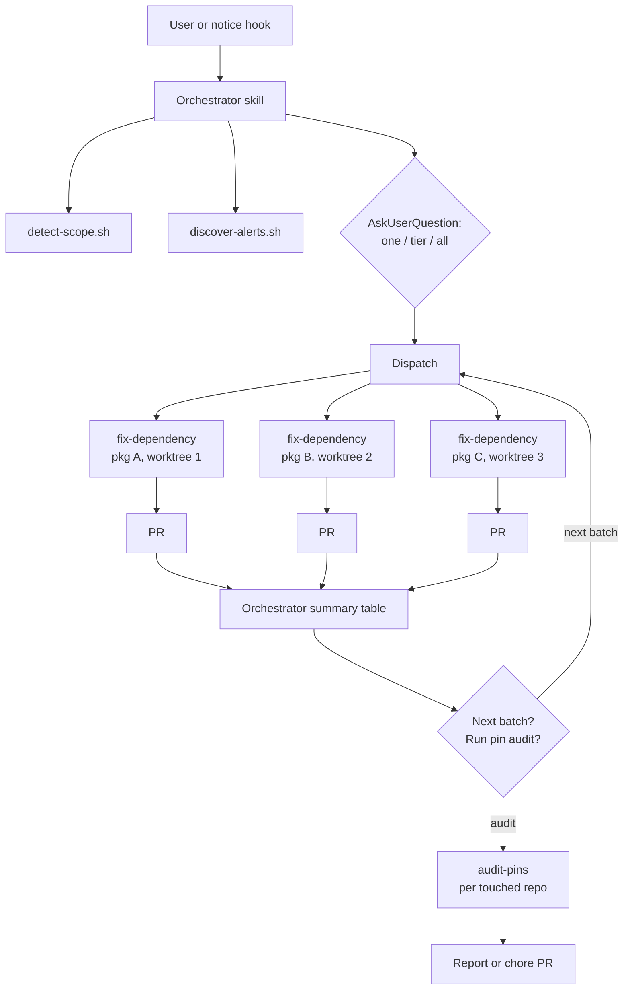

# RFC 001: Orchestrated Multi-Agent Security Alert Resolution

## Summary

Convert the `gh-security` plugin from a single-shot, one-package-per-invocation command into an orchestrated multi-agent workflow. An orchestrator skill discovers Dependabot alerts at repo, org, or user scope, asks the user how much to fix (one package, the highest severity tier, or everything), then spawns one fix subagent per vulnerable package in parallel, each working in an isolated git worktree through to an open PR. An audit subagent finds previously pinned transitive dependencies whose pins are no longer needed; it runs automatically when a dispatch slot is spare, is recommended opt-in after full dispatches, and is invocable directly as its own command. All deterministic work (alert discovery, scope detection, package manager detection, override insertion, lockfile validation) moves into scripts so agents consume structured JSON instead of re-deriving procedures each session, cutting token cost and variance and allowing subagents to run on a smaller model. Every PR opened carries a computed merge-risk rating (Low / Medium / High) derived from version delta, runtime exposure, usage surface, and test signal, so reviewers can calibrate scrutiny per PR. Ecosystem-specific behavior lives behind a small adapter contract: node and Python ship as adapters, and alerts from other ecosystems are skipped and reported rather than attempted.

## Motivation

The current `/gh-security:fix-alert` command works well but resolves exactly one package group per invocation, with a developer driving each run interactively. Two parts are explicitly worth preserving because they already work: target selection (grouping alerts by package and ranking by severity then EPSS exploitability reliably surfaces the most impactful dependency first) and open-PR deduplication (skipping any package that already has a fix PR open on its `fix/dependabot-<package>` branch). Both already live script-side in `discover-alerts.sh` rather than in command prose, so the orchestrator inherits them unchanged and no extraction work is needed for either. A repo with six vulnerable packages needs six sequential sessions. An org with alerts across a dozen repos needs a developer to visit each repo and repeat the process. The work is highly repetitive: the judgment moments (is this direct or transitive, did the install break, is a script failure pre-existing) are small islands in an otherwise mechanical procedure.

Three specific gaps:

1. **No parallelism.** Fixes for independent packages do not conflict semantically, yet they run serially because a single session edits one `package.json` and one branch at a time.
2. **No scope above the repo.** GitHub exposes an org-level aggregate endpoint for Dependabot alerts, but the command only knows the current repo. Cross-repo cleanup requires manual repetition.
3. **No cleanup path.** Scoped overrides added to fix transitive alerts accumulate. When a direct dependency later updates past the vulnerable range, the pin becomes dead weight that can silently hold packages back. Nothing audits these today.

Additionally, the current command embeds deterministic procedures (package manager tables, lockfile grep patterns, override JSON shapes) as prose the model re-interprets every session. That is token cost and behavioral variance we can eliminate with scripts.

## Goals / Non-Goals

**Goals**

- One fix subagent per vulnerable package, runnable in parallel, each producing its own PR.
- An orchestrator that discovers alerts, checks existing PRs, asks the user for scope (one, tier, or all), and dispatches subagents.
- Org scope via the aggregate endpoint; user scope via deterministic per-repo fan-out.
- A pin-audit subagent that identifies removable overrides and resolutions.
- Deterministic work extracted to scripts with JSON output contracts.
- Ecosystem-specific behavior isolated behind an adapter contract, with node (`npm` alerts) and Python (`pip` alerts) supported.
- Model tiering: subagents pinned to a cheaper model; orchestrator guidance documented.
- Natural-language triggering via a skill description, with the slash command kept as an explicit entry point.
- A proactive nudge when the GitHub CLI surfaces a vulnerability notice mid-session.

**Non-Goals**

- Auto-merging PRs. A human reviews and merges every PR this system opens.
- Exhaustive ecosystem coverage. The adapter layer supports `npm` (pnpm, npm, yarn, bun) and `pip` (uv, poetry, pip-tools, pipenv) alerts. Alerts from the remaining advisory ecosystems (`rubygems`, `maven`, `nuget`, `composer`, `go`, `rust`, `erlang`, `actions`, `pub`, `swift`, `other`) are skipped and reported, and a new adapter gets built when someone on the team asks for one, not by default.
- Eval tests for skill triggering. The `resolve-alerts` description is the only security-alert skill in the marketplace today, so there is nothing to mistrigger against. Evals become worthwhile once closely related skills exist in this or neighboring plugins and accidental cross-triggering becomes a real risk; until then they are deferred.
- Scheduled or CI-driven execution (GitHub Actions, cron). This remains an interactive, developer-initiated tool.
- Replacing Dependabot's own update PRs. This tool covers what Dependabot cannot: scoped overrides for transitives, full repo script validation, and batch judgment.
- EMU (enterprise managed user) orgs. Only a few EMU members have access to the org-level alert endpoints, so the value is limited today. If EMU-wide alert counts warrant it later, a scheduled (weekly or daily) automated run built on these agents could be a future initiative; it is explicitly not this one.

## Proposed Approach

### Component overview

```
plugins/gh-security/
  .claude-plugin/plugin.json
  skills/
    resolve-alerts/
      SKILL.md              # orchestrator (replaces commands/fix-alert.md)
  agents/
    fix-dependency.md       # per-package fix subagent
    audit-pins.md           # override/resolution audit subagent
  commands/
    resolve-alerts.md       # thin wrapper: invokes the skill explicitly
    fix-alert.md            # compatibility shim: "one" path, no scope prompt
    audit-pins.md           # direct entry: run the pin audit on demand
  scripts/
    common/
      detect-scope.sh       # cwd -> {scope: repo|org|user, owner, repo?}
      detect-capacity.sh    # cores + total RAM -> concurrency cap (3-6)
      discover-alerts.sh    # extended: --scope repo|org|user
      select-adapter.sh     # alert ecosystem + manifest_path -> adapter
      check-advisories.sh   # union of vulnerable ranges for a pkg from the advisory DB
      score-merge-risk.sh   # compute merge-risk factors for the PR body
    ecosystems/
      node.sh               # npm alerts: pnpm/npm/yarn/bun
      python.sh             # pip alerts: uv/poetry/pip-tools/pipenv
  hooks/
    hooks.json
    notice-scan.sh          # PostToolUse: detect GitHub vulnerability notices
```



### Orchestrator skill

The orchestrator is a skill (`resolve-alerts`) that runs in the main session. Flow:

1. **Detect scope.** `detect-scope.sh` maps the working directory to repo, org, or user scope using the existing `@`-segment convention. The user can override by asking explicitly ("fix alerts across the whole org").
2. **Discover.** `discover-alerts.sh --scope <scope>` fetches, groups, ranks, and PR-checks alerts (see endpoint strategy below). Output is the existing `{actionable, skipped}` contract, with each group additionally carrying `repo` so cross-repo dispatch works.
3. **Ask.** Present the ranked table, then AskUserQuestion with three options:
   - **One**: fix only the top-ranked group (current behavior).
   - **Highest tier**: fix every group at the highest severity present. If no critical alerts exist, this means all high; if none, all medium, and so on.
   - **Everything**: fix all actionable groups.
4. **Approve once.** Show the dispatch plan (package, repo, severity, action type, branch) and get a single confirmation. This replaces the current per-run "ready to ship?" pause: subagents run unattended through PR creation, and the PR itself becomes the review artifact.
5. **Dispatch.** Spawn one `fix-dependency` subagent per group, each receiving the group JSON, its adapter's detection JSON, and repo metadata as its prompt payload. No subagent re-discovers anything. Concurrency is capped **machine-wide per invocation**, derived at dispatch time by `detect-capacity.sh`: `clamp(min(floor(cores / 3), floor(total_ram_gb / 8)), 3, 6)`, read via unprivileged `sysctl` (macOS) or `nproc` and `/proc/meminfo` (Linux), no special permissions involved. Total RAM is used rather than available RAM so the cap is deterministic per machine instead of fluctuating per invocation. If detection fails, the cap falls back to 3. The cap bounds local machine load, not the agent harness: each agent runs a dependency install plus the repo's scripts, and builds and test suites parallelize internally across cores, so a small number of concurrent agents saturates a laptop well before any harness limit is reached. The floor of 3 is sized to the older end of the laptops we expect this to run on; larger machines earn more slots, and the ceiling of 6 reflects where registry bandwidth and disk contention dominate regardless of cores. Fix subagents get the slots first. If the approved batch has fewer fix groups than slots, the orchestrator dispatches the audit in a spare slot immediately, without asking; the opt-in flow in step 7 applies only when fixes fill all slots.
6. **Summarize.** Collect results and present a table: package, repo, PR URL, resolved version, risk rating, script results.
7. **Offer next steps.** If actionable groups remain (the user chose one or a tier), offer to dispatch the next batch. Then, unless the audit already ran in a spare slot during dispatch, recommend the pin audit. When fixes fill all slots the audit is deliberately opt-in rather than dispatched alongside them: an eager audit would consume a fix slot, trading a fix for housekeeping in a full dispatch. On acceptance, spawn one `audit-pins` subagent per repo touched (or per repo in scope); audit agents count against the same concurrency cap when they run, since their removability tests also run installs.

### Scope and endpoint strategy

GitHub's aggregate endpoints are asymmetric, and the orchestrator must know this rather than guess:

| Scope | Endpoint strategy |
|---|---|
| Repo | `GET /repos/{owner}/{repo}/dependabot/alerts` (current behavior) |
| Org | `GET /orgs/{org}/dependabot/alerts` (single aggregate call, paginated) |
| User | No aggregate endpoint exists. Enumerate `GET /user/repos?type=owner`, skip forks and archived repos, then fan out per-repo alert calls inside the script |

All three live behind `discover-alerts.sh --scope`, so the orchestrator prompt never contains endpoint logic. The user fan-out stays inside one script invocation: dozens of repo calls happen in bash, not as dozens of agent tool calls.

At org and user scope, the script also records whether the authenticated user can push to each repo. Repos without push access are not dispatched, and the orchestrator's summary lists each skipped repo by name so the user knows exactly what was left untouched. This should be rare in practice, but it must never be silent.

### Ecosystem adapters

Every alert is ecosystem-tagged at the source: `dependency.package.ecosystem` plus `manifest_path`. GitHub's advisory ecosystem enum is `rubygems`, `npm`, `pip`, `maven`, `nuget`, `composer`, `go`, `rust`, `erlang`, `actions`, `pub`, `swift`, and `other` (verified against the REST OpenAPI description). Two are in scope: `npm` routes to the node adapter, `pip` to the Python adapter. `select-adapter.sh` keys on the alert's ecosystem and manifest path, not on scanning the repo root, so polyglot repos route each alert to the right toolchain. Alerts for the other eleven ecosystems are skipped with reason "ecosystem not supported yet" and surfaced in the orchestrator summary alongside repos without push access; never an error, and a new adapter is built when the team asks for one.

Each adapter implements the same verbs: `detect` (toolchain from lockfile/manifest), `why`, `apply_constraint`, `install`, `validate`, `list_pins`, `verification_commands`, and `compare_versions`. Agent prompts reference only these verbs; everything ecosystem-specific stays inside the adapter, including version comparison (`discover-alerts.sh`'s current naive dot-split sort for `highest_fixed_version` delegates to the adapter).

Where the two adapters genuinely differ, beyond spelling:

- **Constraints, not scoped overrides.** Node resolvers nest multiple versions of a package, which is why parent-scoped overrides exist; that logic stays inside `node.sh`. Python resolvers install exactly one version per environment, so `apply_constraint` is environment-wide (uv `constraint-dependencies`, Poetry direct constraint, pip `constraints.txt`), and flat resolution makes `validate` simpler: one resolved version to check.
- **Version semantics.** Python is PEP 440 (epochs, `post`/`dev` releases, `>=3.1.2,<4` comma syntax); node is semver. Range emission and comparison are adapter responsibilities.
- **Verification.** No `package.json` scripts in Python; `verification_commands` detects what exists (tox/nox environments, Makefile targets, `pytest`/`ruff`/`mypy` configs, pre-commit hooks) and emits a runnable list.
- **Import-name mapping.** The PyPI name often is not the import name (`pillow` imports as `PIL`, `beautifulsoup4` as `bs4`), so the Python adapter maps names before the rubric's F3 import grep, or F3 would silently score zero usage.

### Fix subagent (`fix-dependency`)

Phases 4 through 9 of the current command, parameterized. Input: one package group JSON plus PM and repo metadata. The subagent:

1. Creates an isolated git worktree from the default branch and creates the fix branch there. Worktree isolation is what makes same-repo parallelism safe: two subagents editing the same `package.json` and lockfile cannot collide. Worktrees do not share installed dependencies, so each runs its own install (accepted cost, see Trade-offs).
2. Runs the adapter's `why` to classify direct vs transitive and identify parents.
3. Applies the fix: direct version bump via Edit, or the adapter's `apply_constraint` for transitives (major-bounded; parent-scoped in node, environment-wide in Python).
4. Installs, validates via the adapter, and runs the adapter's `verification_commands` (the one genuinely judgment-heavy step: diagnosing failures and distinguishing pre-existing breakage).
5. Commits, pushes, opens the PR with the existing body format plus a merge-risk rating (see rubric below), and returns a structured result (PR URL, resolved version, risk rating, script outcomes, or a failure report). PRs open ready for review, not as drafts; the merge-risk rating is the reviewer's caution signal.

A subagent that cannot complete safely (validation fails, scripts break in ways attributable to the update) stops, cleans up its worktree, and returns a failure report instead of asking the user mid-flight. The orchestrator surfaces failures in the summary for a human-driven follow-up session.

### Merge-risk rubric

Every PR the fix subagent opens carries a **merge risk** rating (Low / Medium / High) so a reviewer can calibrate scrutiny before reading a line of diff. The rating is computed, not vibes: five factors, each scored 0 to 2, summed to a 0-10 score with a factor breakdown table in the PR body.

| # | Factor | 0 | 1 | 2 |
|---|---|---|---|---|
| F1 | **Version delta** (previously resolved version to newly resolved version, via the adapter's version compare) | Patch | Minor | Major |
| F2 | **Runtime exposure** (where the package sits in the graph) | Dev-only chain (every path enters via `devDependencies`) | Transitive under a runtime dependency | Direct runtime dependency |
| F3 | **Usage surface** (for direct deps: modules importing the package; for transitives: modules importing its direct parent) | No source imports (build/tooling only) | 1-5 importing modules | More than 5 importing modules, or imports in entry points |
| F4 | **Test signal** | Repo tests pass and test files exercise the importing modules | Tests pass but none clearly exercise the affected modules | No test script, or tests could not run |
| F5 | **Verification completeness** (from the subagent's own run) | All repo scripts ran clean | Scripts ran; pre-existing failures noted | One or more scripts skipped or partially run |

Bands: **Low** 0-3, **Medium** 4-6, **High** 7-10, with one escalation rule: a major version delta (F1 = 2) never rates Low, regardless of total. A major bump of an untested, widely imported runtime dependency lands where it should (High); a patch bump of a dev-only transitive with passing tests lands at Low. These bands and thresholds ship as-is as the starting baseline; feedback from engineers reviewing scored PRs drives adjustments, recorded in the calibration ADR (see Decisions & Follow-ups).

Division of labor follows the same principle as everything else here. `score-merge-risk.sh` computes F1 (version compare of lockfile versions before and after, via the adapter's `compare_versions`), F2 (dependency graph classification from the `why` output and the manifest), and F3 (import-site grep across source files using the adapter's per-language import patterns and name mapping, excluding tests and build output). F4 and F5 are facts the subagent already has from its verification phase and passes in as inputs; the script applies the scoring and emits the JSON breakdown. If the repo has coverage tooling configured, the subagent may refine F4 with actual coverage of the importing modules, noting in the PR body which signal was used.

PR body addition:

```markdown
## Merge risk: Medium (5/10)

| Factor | Score | Evidence |
|---|---|---|
| Version delta | 1 | 4.17.15 -> 4.18.2 (minor) |
| Runtime exposure | 2 | Direct runtime dependency |
| Usage surface | 1 | Imported in 3 modules |
| Test signal | 1 | Tests pass; affected modules not directly exercised |
| Verification | 0 | lint, test, build all clean |
```

The audit-pins subagent reuses the same rubric for its removal PRs, scoring the delta between pinned and naturally resolved versions.

### Pin-audit subagent (`audit-pins`)

The common lifecycle this addresses: we pin a transitive dependency (override/resolution) because a direct dependency has not yet updated past a vulnerable range. Later the direct dependency updates, and the pin becomes unnecessary. Three entry points: the orchestrator runs it automatically in a spare slot when the fix batch is small (steps 5 and 7 above), recommends it opt-in after a full dispatch completes, and `commands/audit-pins.md` runs it directly on demand without going through alert resolution at all. Input: one repo. The subagent:

1. Runs the adapter's `list_pins` to extract every constraint entry with its range (overrides/resolutions in `package.json` for node; uv constraints, Poetry pins, or `constraints.txt` entries for Python).
2. For each pin, gathers provenance: `git log -S` on the entry, linked PRs, and referenced alerts (including `state=fixed` Dependabot alerts for that package).
3. Tests removability in a scratch worktree: remove the pin, install, and check the naturally resolved version for safety. The safe range comes from `check-advisories.sh`, which unions the vulnerable ranges of **every published advisory for the package** (`gh api /advisories?affects=<pkg>`), not just the advisory that prompted the pin. The repo's own alert history cannot be the source of truth here: the pin itself kept vulnerable versions out of the lockfile, so advisories published after the pin never surfaced as alerts, and removing the pin on history alone could reintroduce exactly what was published in the interim. The pin is removable only if the naturally resolved version clears every advisory's range.
4. Reports findings; in a later phase, opens a `chore(deps): remove stale overrides` PR through the same validate-and-run-scripts pipeline as the fix subagent.

Starting report-only keeps the blast radius small while we build confidence in step 3's correctness.

### Deterministic script extraction

Principle: **agents decide, scripts do.** Anything with one correct procedure becomes a script with a JSON contract. From the current command prose, that means:

| Current prose | Becomes | Notes |
|---|---|---|
| Phase 1 owner/repo derivation | `detect-scope.sh` | Also classifies repo/org/user |
| Phase 2 PM table | `select-adapter.sh` + adapter `detect` | Routes by alert ecosystem and manifest; emits toolchain commands |
| Phase 3 | `discover-alerts.sh` | Already exists; gains `--scope` |
| Phase 6 override JSON shapes | adapter `apply_constraint` | Merges with existing entries; per-toolchain syntax lives in the adapter |
| Phase 8b lockfile greps | adapter `validate` | Exits non-zero with violating versions on failure |
| (new) pin extraction | adapter `list_pins` | For the audit subagent |
| (new) advisory ranges | `check-advisories.sh` | Unions vulnerable ranges across all published advisories for a package |
| (new) risk scoring | `score-merge-risk.sh` | Computes F1-F3 via adapter verbs, applies bands to agent-supplied F4/F5 |
| (new) capacity detection | `detect-capacity.sh` | Cores and total RAM to concurrency cap, clamped 3-6 |

What stays with the agent: interpreting install failures, judging script failures as pre-existing or caused, deciding when a lockfile regeneration is warranted, and writing PR prose.

### Model selection

| Component | Model | Rationale |
|---|---|---|
| `fix-dependency` | `sonnet` (frontmatter pin) | With discovery, override insertion, and validation scripted, the remaining judgment (install failures, script triage) is well within Sonnet. Haiku was considered and rejected: debugging a broken install or a failing test suite is exactly where a too-small model produces confident nonsense. |
| `audit-pins` | `sonnet` | Same profile: scripted extraction, moderate judgment on provenance. |
| Orchestrator | inherits session model | Skills run in the main session and cannot pin a model. With dispatch scripted, the orchestrator is mostly presentation and routing; Sonnet is sufficient, and we document that in the skill. Opus adds nothing once the endpoint and ranking logic live in scripts. |

If experience shows the fix subagent is more mechanical than expected, dropping to Haiku is a one-line frontmatter change; starting at Sonnet is the safer default.

### Trigger mechanism

Two changes:

1. **Command to skill.** The orchestrator ships as `skills/resolve-alerts/SKILL.md` with a description written for model-triggered invocation ("resolve Dependabot security alerts", "fix security vulnerabilities in dependencies", "clean up npm audit findings"). A thin `commands/resolve-alerts.md` remains for explicit `/gh-security:resolve-alerts` invocation. `commands/fix-alert.md` is preserved as a compatibility shim: it invokes the orchestrator with the scope question pre-answered as "one" (fix only the top-ranked group), spawning a single `fix-dependency` subagent, which is behaviorally what the command does today; with two slots spare, the pin audit runs automatically alongside, and the shim offers the next batch when the fix completes. On each run the shim prints a short notice: the command is deprecated and will be removed in a future release, and the same result is available by asking Claude to fix the repo's security alerts or by running `/gh-security:resolve-alerts`. Anyone with the old command in muscle memory keeps working; the notice steers them to the canonical entry points. The shim is short-lived by design: it is removed in the first release cut at least two months after it ships.
2. **Proactive notice hook.** The plugin ships a PostToolUse hook on Bash that scans tool output for GitHub's push-time vulnerability notice (`GitHub found N vulnerabilities on ...`) and Dependabot URLs in `gh` output. On match, it emits additional context telling Claude to offer the `resolve-alerts` skill and ask whether to start. The hook also matches package manager audit output (`npm audit` / `pnpm audit` summaries and install-time vulnerability warnings), with a deliberate asymmetry: PM audit findings may not correspond to any GitHub alert, and every prompt in this system is written against GitHub alert data, so a subagent handed raw audit output would be working outside its contract. A PM-audit match therefore only nudges: it suggests checking GitHub security alerts via the skill, discovery proceeds from GitHub as the sole source of truth, and if GitHub shows no open alerts the orchestrator reports that and stops rather than attempting to reconcile the package manager's findings. The hook is a fast grep (exit 0 on no match, no network calls), so per-Bash-call overhead is negligible. It suggests; it never auto-runs.

## Alternatives Considered

- **Dependabot security updates / grouped PRs.** Dependabot can already open fix PRs for direct dependencies. It cannot add parent-scoped overrides for transitives (the majority of real alerts in practice), does not run the repo's own scripts before opening a PR, and its grouped updates are noisy in a way that costs review trust. This tool exists precisely for the gap Dependabot leaves.
- **Renovate.** Stronger than Dependabot on grouping and scheduling, but the same transitive-override gap applies, and introducing a third-party service is a bigger organizational lift than extending a tool already in use.
- **One large agent doing everything serially.** Simplest to build (the current command, looped). Rejected: context grows with every package, token cost scales superlinearly, one failure mid-loop strands the remainder, and wall-clock time is the sum rather than the max of package fix times.
- **GitHub Action instead of a Claude Code plugin.** Would enable scheduled runs, but loses the interactive judgment moments (scope choice, failure triage) that make the results trustworthy, and requires credential management this plugin gets for free from the developer's `gh` session. Could be a future layer on top, not the foundation.
- **Orchestrator as a pinned-model agent instead of a skill.** Would allow pinning the orchestrator's model, but subagent-spawning from within a subagent and AskUserQuestion interaction both fit poorly. The skill-in-main-session shape keeps the user conversation where it belongs.
- **Per-PR user approval (current behavior) retained in parallel mode.** Rejected: N subagents pausing for N confirmations serializes the human and defeats the parallelism. A single upfront batch approval plus PR review preserves control with one interaction.

## Trade-offs & Risks

- **Worktree install cost.** Each parallel subagent runs a full dependency install and the repo's scripts in its own worktree. For heavy repos this is minutes of wall clock and gigabytes of disk per concurrent agent, and script runs parallelize internally across cores, so machine saturation arrives before harness limits do. Cross-repo dispatch at org scope compounds on the same machine, which is why the cap is machine-wide rather than per-repo, and covers fix and audit agents alike. pnpm's content-addressable store softens the install cost considerably for pnpm repos.
- **Batch approval reduces per-PR control.** The user approves a plan, not each commit. Mitigation: PRs are the review artifact, nothing merges automatically, and the summary table makes it easy to close any unwanted PR.
- **Duplicate-PR races.** Two sessions running concurrently could both dispatch the same package. The branch-existence check in discovery mitigates the common case; the residual race window is accepted (the second PR fails on branch push and reports cleanly).
- **Org endpoint permissions.** `GET /orgs/{org}/dependabot/alerts` requires org-level security visibility (security manager or admin). The script must detect a 403 and fall back to per-repo enumeration of repos the user can access, or report the limitation clearly.
- **Rate limits at user/org scope.** Fan-out over many repos plus per-package PR checks can burn REST quota. The script batches and paginates, but very large orgs may need a `--repo-limit` guard.
- **Pin-removal false positives.** The audit subagent declaring a pin removable when it still matters would reintroduce a vulnerability. Mitigation: report-only first phase; removability is judged against the full advisory database rather than the repo's own alert history (which the pin itself blinds); removal PRs re-run the full lockfile validation against the unioned vulnerable ranges.
- **Hook noise.** A PostToolUse hook on every Bash call is a standing cost. The scan is a local grep with no network calls, and it emits context only on match, but it is one more moving part to keep silent when irrelevant.
- **Subagents cannot ask questions.** Failure modes that today get interactive resolution (lockfile regeneration confirmation) become stop-and-report. Some fixes that would have succeeded interactively will land in the failure column and need a follow-up session.

## Rollout / Migration Plan

Phases are sequential PRs, each leaving the plugin fully working. Versions follow the marketplace `version` field.

1. **Phase 1: script extraction (v0.2.0).** Extract the deterministic surface into `scripts/common/` and define the adapter contract, landing `ecosystems/node.sh` as the first adapter. Rewrite `fix-alert.md` to consume them and add the merge-risk section to the PR body. Otherwise behavior identical to today; the command shrinks and the deterministic surface moves to scripts with tests run against real repos. Defining the contract now is deliberate: retrofitting adapters after five phases of node-shaped scripts is the expensive version of the same work.
2. **Phase 2: subagent + orchestrator, repo scope (v0.3.0).** Add `agents/fix-dependency.md` and `skills/resolve-alerts/SKILL.md` with the one/tier/all question, worktree isolation, parallel dispatch with the capacity-derived cap (`detect-capacity.sh`), and batch approval. Add thin `commands/resolve-alerts.md`; convert `commands/fix-alert.md` to the deprecation shim (pre-answered "one" scope, migration notice). Update README and marketplace description.
3. **Phase 3: org and user scope (v0.4.0).** Extend `discover-alerts.sh` with `--scope`, add push-access filtering (with skipped repos listed in the summary) and the 403 fallback. Orchestrator gains cross-repo dispatch. EMU orgs are out of scope (see Non-Goals).
4. **Phase 4: pin audit (v0.5.0).** Add the adapter `list_pins` verb, `check-advisories.sh`, `agents/audit-pins.md`, and the direct `commands/audit-pins.md` entry point, report-only. Wire the orchestrator's post-fix recommendation. Graduate to chore-PR mode in a subsequent minor once findings prove reliable.
5. **Phase 5: proactive hook (v0.6.0).** Add `hooks/hooks.json` and `notice-scan.sh`.
6. **Phase 6: Python adapter (v0.7.0).** Add `ecosystems/python.sh`: uv/poetry/pip-tools/pipenv detection, PEP 440 version handling, environment-wide constraints, verification detection, and PyPI-to-import name mapping for F3. No changes to agents or the orchestrator; that is the adapter contract paying off.

Each phase gets a GitHub issue before implementation; hard decisions made during a phase get an ADR linked back here.

## Open Questions

None currently open. Every question raised during review has been settled and incorporated; see Decisions & Follow-ups.

## Decisions & Follow-ups

Settled during RFC review and incorporated above:

- PRs open ready for review, not as drafts; the merge-risk rating carries the caution signal.
- At org scope, repos skipped for lack of push access are listed by name in the summary, never silently dropped.
- The notice hook matches package manager audit output, but only as a nudge to check GitHub security alerts; GitHub remains the sole data source for the fix pipeline, and the orchestrator stops cleanly when GitHub shows no open alerts.
- The `fix-alert` shim is removed in the first release cut at least two months after it ships.
- The merge-risk rubric ships as-is as the starting baseline, adjusted from team feedback via the calibration ADR.
- EMU support is explicitly out of scope (moved to Non-Goals); a scheduled EMU-wide run is a possible future initiative.
- The concurrency cap is derived per machine at dispatch time (`detect-capacity.sh`, unprivileged core and RAM reads), clamped to 3-6 with 3 as the detection-failure fallback, instead of a fixed baseline.
- Pin removability is judged against the full advisory database (`check-advisories.sh`), never the repo's own alert history alone: a pin keeps vulnerable versions out of the lockfile, so advisories published after the pin never generated alerts, and history-based judgment would reintroduce them.
- Ecosystem support is adapter-based: `npm` and `pip` ship; alerts from the other eleven advisory ecosystems are skipped and reported in the summary like no-access repos, with new adapters added on team request rather than by default.

To be spawned as this RFC executes:

- ADR: batch approval model replacing per-PR confirmation.
- ADR: model tiering for subagents (and the Haiku re-evaluation criteria).
- ADR: worktree isolation strategy and concurrency cap.
- ADR: merge-risk rubric weights and bands, once calibrated against real PRs.
- Issues: one per rollout phase, linked in `related_issues` as they are opened.
- Skill/rule graduation: the constraint rules (major-bounded ranges, parent scoping where the ecosystem supports it) are already durable guidance; they move from command prose into the adapters' `apply_constraint` and the subagent prompt rather than a separate rule.

## Related

- Current implementation: `plugins/gh-security/commands/fix-alert.md`, `plugins/gh-security/scripts/discover-alerts.sh`
- RFC process rule: `.claude/rules/path-docs-rfc.md` (adopted from `sm-incubator/beta-recognition`)
- GitHub REST: [Dependabot alerts endpoints](https://docs.github.com/en/rest/dependabot/alerts)
