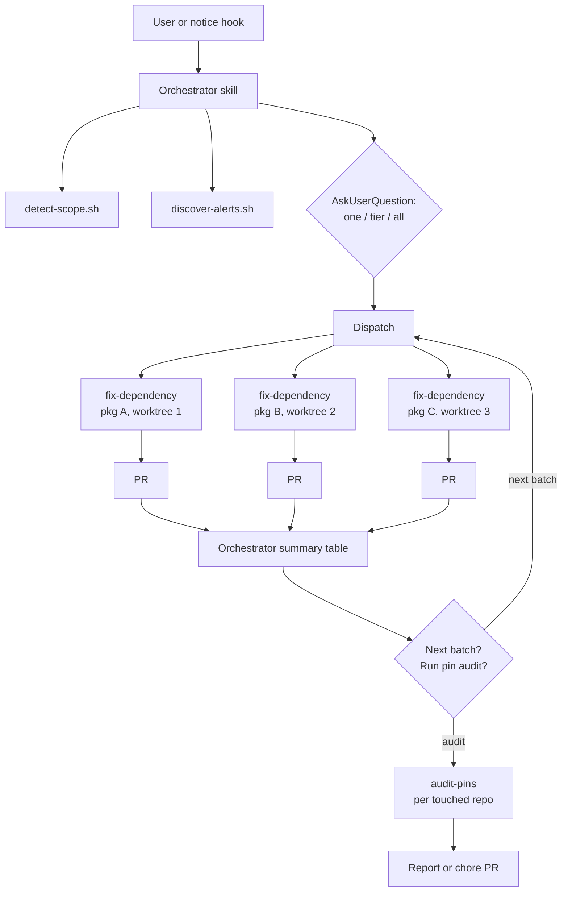

# RFC 001: Orchestrated Multi-Agent Security Alert Resolution

## Summary

Convert the `gh-security` plugin from a single-shot, one-package-per-invocation command into an orchestrated multi-agent workflow. An orchestrator skill discovers Dependabot alerts at repo, org, or user scope, asks the user how much to fix (one package, the highest severity tier, or everything), then spawns one fix subagent per vulnerable package in parallel, each working in an isolated git worktree through to an open PR. An audit subagent finds previously pinned transitive dependencies whose pins are no longer needed; ~~it runs automatically when a dispatch slot is spare, is recommended opt-in after full dispatches, and~~ **Superseded** ([#108](https://github.com/SurveyMonkey/skills/issues/108), [ADR 009](../adr/009-decouple-pin-audit.md)): the orchestrator never dispatches or recommends it at any point in a run — it edits the same overrides block fix agents are adding to and tightening, on a different branch against the same base. It is invocable directly as its own command. All deterministic work (alert discovery, scope detection, package manager detection, override insertion, lockfile validation) moves into scripts so agents consume structured JSON instead of re-deriving procedures each session, cutting token cost and variance and allowing subagents to run on a smaller model. Every PR opened carries a computed merge-risk rating (Low / Medium / High) derived from version delta, runtime exposure, usage surface, and test signal, so reviewers can calibrate scrutiny per PR. Ecosystem-specific behavior lives behind a small adapter contract: node and Python ship as adapters, and alerts from other ecosystems are skipped and reported rather than attempted.

## Motivation

The current `/gh-security:fix-alert` command works well but resolves exactly one package group per invocation, with a developer driving each run interactively. Two parts are explicitly worth preserving because they already work: target selection (grouping alerts by package and ranking by severity then EPSS exploitability reliably surfaces the most impactful dependency first) and open-PR deduplication (skipping any package that already has a fix PR open on its `fix/dependabot-<package>` branch). Both already live script-side in `discover-alerts.sh` rather than in command prose, so the orchestrator inherits them unchanged and no extraction work is needed for either. A repo with six vulnerable packages needs six sequential sessions. An org with alerts across a dozen repos needs a developer to visit each repo and repeat the process. The work is highly repetitive: the judgment moments (is this direct or transitive, did the install break, is a script failure pre-existing) are small islands in an otherwise mechanical procedure.

Three specific gaps:

1. **No parallelism.** Fixes for independent packages do not conflict semantically, yet they run serially because a single session edits one `package.json` and one branch at a time.
2. **No scope above the repo.** GitHub exposes an org-level aggregate endpoint for Dependabot alerts, but the command only knows the current repo. Cross-repo cleanup requires manual repetition.
3. **No cleanup path.** Scoped overrides added to fix transitive alerts accumulate. When a direct dependency later updates past the vulnerable range, the pin becomes dead weight that can silently hold packages back. Nothing audits these today.

Additionally, the current command embeds deterministic procedures (package manager tables, lockfile grep patterns, override JSON shapes) as prose the model re-interprets every session. That is token cost and behavioral variance we can eliminate with scripts.

## Goals / Non-Goals

**Goals**

- One fix subagent per vulnerable package, runnable in parallel, each producing its own PR.
- An orchestrator that discovers alerts, checks existing PRs, asks the user for scope (one, tier, or all), and dispatches subagents.
- Org scope via the aggregate endpoint; user scope via deterministic per-repo fan-out.
- A pin-audit subagent that identifies removable overrides and resolutions.
- Deterministic work extracted to scripts with JSON output contracts.
- Ecosystem-specific behavior isolated behind an adapter contract, with node (`npm` alerts) and Python (`pip` alerts) supported.
- Model tiering: subagents pinned to a cheaper model; orchestrator guidance documented.
- Natural-language triggering via a skill description, with the slash command kept as an explicit entry point.
- A proactive nudge when the GitHub CLI surfaces a vulnerability notice mid-session.

**Non-Goals**

- Auto-merging PRs. A human reviews and merges every PR this system opens.
- Exhaustive ecosystem coverage. The adapter layer supports `npm` (pnpm, npm, Yarn Berry) and `pip` (uv, poetry, pip-tools, pipenv) alerts. bun and Yarn Classic v1 are explicitly out of scope (see Decisions & Follow-ups); the node adapter detects both and reports them as unsupported rather than failing. Alerts from the remaining advisory ecosystems (`rubygems`, `maven`, `nuget`, `composer`, `go`, `rust`, `erlang`, `actions`, `pub`, `swift`, `other`) are skipped and reported, and a new adapter gets built when someone on the team asks for one, not by default.
- Eval tests for skill triggering. The `resolve-alerts` description is the only security-alert skill in the marketplace today, so there is nothing to mistrigger against. Evals become worthwhile once closely related skills exist in this or neighboring plugins and accidental cross-triggering becomes a real risk; until then they are deferred.
- Scheduled or CI-driven execution (GitHub Actions, cron). This remains an interactive, developer-initiated tool.
- Replacing Dependabot's own update PRs. This tool covers what Dependabot cannot: scoped overrides for transitives, full repo script validation, and batch judgment.
- EMU (enterprise managed user) orgs. Only a few EMU members have access to the org-level alert endpoints, so the value is limited today. If EMU-wide alert counts warrant it later, a scheduled (weekly or daily) automated run built on these agents could be a future initiative; it is explicitly not this one.

## Proposed Approach

### Component overview

```
plugins/gh-security/
  .claude-plugin/plugin.json
  skills/
    resolve-alerts/
      SKILL.md              # orchestrator (replaces commands/fix-alert.md)
  agents/
    fix-dependency.md       # per-package fix subagent
    audit-pins.md           # override/resolution audit subagent
  commands/
    resolve-alerts.md       # thin wrapper: invokes the skill explicitly
    fix-alert.md            # compatibility shim: "one" path, no scope prompt (removed in v0.8.4, #95)
    audit-pins.md           # direct entry: run the pin audit on demand
  scripts/
    common/
      detect-scope.sh       # cwd -> {scope: repo|org|user, owner, repo?}
      detect-capacity.sh    # cores + total RAM -> concurrency cap (3-6)
      discover-alerts.sh    # extended: --scope repo|org|user
      select-adapter.sh     # alert ecosystem + manifest_path -> adapter
      check-advisories.sh   # union of vulnerable ranges for a pkg from the advisory DB
      score-merge-risk.sh   # compute merge-risk factors for the PR body
    ecosystems/
      node.sh               # npm alerts: pnpm/npm/Yarn Berry
      python.sh             # pip alerts: uv/poetry/pip-tools/pipenv
  hooks/
    hooks.json
    notice-scan.sh          # PostToolUse: detect GitHub vulnerability notices
```



**Superseded** ([#108](https://github.com/SurveyMonkey/skills/issues/108),
[ADR 009](../adr/009-decouple-pin-audit.md)): the `Q2` branch above no longer exists. `Sum` flows
straight to the next-batch offer only; there is no `audit` option and no `P` node here. The pin
audit is reached only through `/gh-security:audit-pins`, run separately once a batch's fix PRs have
landed, never dispatched by the orchestrator.

### Orchestrator skill

The orchestrator is a skill (`resolve-alerts`) that runs in the main session. Flow:

1. **Detect scope.** `detect-scope.sh` maps the working directory to repo, org, or user scope using the existing `@`-segment convention. The user can override by asking explicitly ("fix alerts across the whole org").
2. **Discover.** `discover-alerts.sh --scope <scope>` fetches, groups, ranks, and PR-checks alerts (see endpoint strategy below). Output is the existing `{actionable, skipped}` contract, with each group additionally carrying `repo` so cross-repo dispatch works.
3. **Ask.** Present the ranked table, then AskUserQuestion with three options:
   - **One**: fix only the top-ranked group (current behavior).
   - **Highest tier**: fix every group at the highest severity present. If no critical alerts exist, this means all high; if none, all medium, and so on.
   - **Everything**: fix all actionable groups.
4. **Approve once.** Show the dispatch plan (package, repo, severity, action type, branch) and get a single confirmation. This replaces the current per-run "ready to ship?" pause: subagents run unattended through PR creation, and the PR itself becomes the review artifact.
5. **Dispatch.** Spawn one `fix-dependency` subagent per group, each receiving the group JSON, its adapter's detection JSON, and repo metadata as its prompt payload. No subagent re-discovers anything. Concurrency is capped **machine-wide per invocation**, derived at dispatch time by `detect-capacity.sh`: `clamp(min(floor(cores / 3), floor(total_ram_gb / 8)), 3, 6)`, read via unprivileged `sysctl` (macOS) or `nproc` and `/proc/meminfo` (Linux), no special permissions involved. Total RAM is used rather than available RAM so the cap is deterministic per machine instead of fluctuating per invocation. If detection fails, the cap falls back to 3. The cap bounds local machine load, not the agent harness: each agent runs a dependency install plus the repo's scripts, and builds and test suites parallelize internally across cores, so a small number of concurrent agents saturates a laptop well before any harness limit is reached. The floor of 3 is sized to the older end of the laptops we expect this to run on; larger machines earn more slots, and the ceiling of 6 reflects where registry bandwidth and disk contention dominate regardless of cores. ~~Fix subagents get the slots first. If the approved batch has fewer fix groups than slots, the orchestrator dispatches the audit in a spare slot immediately, without asking; the opt-in flow in step 7 applies only when fixes fill all slots.~~ **Superseded in v0.8.4** ([#94](https://github.com/SurveyMonkey/skills/issues/94)): the cap is enforced as a rolling pool over a work queue rather than as a wave barrier, so fixes simply take the queue's first positions and ~~the audit is its last item, dispatched as soon as a slot is available for it whatever the size of the batch. There is no spare-slot test and no opt-in fallback.~~ **Superseded** ([#108](https://github.com/SurveyMonkey/skills/issues/108), [ADR 009](../adr/009-decouple-pin-audit.md)): the audit is removed from this queue entirely. It edited the same overrides block fix agents were adding to and tightening, on a different branch against the same base, which is exactly the conflict a field run produced (the field test's audit PR). The orchestrator dispatches `fix-dependency` only. *Audit dispatch — here and in step 7 — ships with Phase 4 ([#7](https://github.com/SurveyMonkey/skills/issues/7)), alongside the agent it dispatches; the Phase 2 orchestrator contains no audit wiring (see Decisions & Follow-ups).*
6. **Summarize.** Collect results and present a table: package, repo, PR URL, resolved version, risk rating, ~~script results~~ (ADR 006).
7. **Offer next steps.** If actionable groups remain (the user chose one or a tier), offer to dispatch the next batch. ~~Then, unless the audit already ran in a spare slot during dispatch, recommend the pin audit. When fixes fill all slots the audit is deliberately opt-in rather than dispatched alongside them: an eager audit would consume a fix slot, trading a fix for housekeeping in a full dispatch.~~ **Superseded in v0.8.4** ([#94](https://github.com/SurveyMonkey/skills/issues/94)): ~~the queue always carries an audit, so the offer here covers the repos the run touched but did not audit, and the groups offered alongside it are the ones declined at step 3, which were never approved rather than left partway through. On acceptance, spawn one `audit-pins` subagent per repo touched (or per repo in scope); audit agents count against the same concurrency cap when they run, since their removability tests also run installs.~~ **Superseded** ([#108](https://github.com/SurveyMonkey/skills/issues/108), [ADR 009](../adr/009-decouple-pin-audit.md)): this step offers only the groups declined at step 3. The pin audit is never recommended here; the closing report instead points at `/gh-security:audit-pins` as separate follow-up work, run once this run's fix PRs have landed, with the reason (the overrides-block conflict above). *The audit recommendation ships with Phase 4, per the step 5 annotation.*

### Scope and endpoint strategy

GitHub's aggregate endpoints are asymmetric, and the orchestrator must know this rather than guess:

| Scope | Endpoint strategy |
|---|---|
| Repo | `GET /repos/{owner}/{repo}/dependabot/alerts` (current behavior) |
| Org | `GET /orgs/{org}/dependabot/alerts` (single aggregate call, paginated) |
| User | No aggregate endpoint exists. Enumerate `GET /user/repos?type=owner`, skip forks and archived repos, then fan out per-repo alert calls inside the script |

All three live behind `discover-alerts.sh --scope`, so the orchestrator prompt never contains endpoint logic. The user fan-out stays inside one script invocation: dozens of repo calls happen in bash, not as dozens of agent tool calls.

At org and user scope, the script also records whether the authenticated user can push to each repo. Repos without push access are not dispatched, and the orchestrator's summary lists each skipped repo by name so the user knows exactly what was left untouched. This should be rare in practice, but it must never be silent.

This holds on the org aggregate path too, not only where the script already enumerates repos: org-wide alert visibility (security manager) and per-repo push access are separate grants, so the combination is ordinary rather than exotic, and a repo dispatched without push access fails only at the fix agent's `git push`, after a clone, a worktree and an install. ~~and a verification run.~~ (ADR 006: no verification run happens any more; the wasted work is the install.) The aggregate alert response carries no permission data, so that path pays one extra `GET /orgs/{org}/repos` purely to read it. Correctness over call count.

### Ecosystem adapters

Every alert is ecosystem-tagged at the source: `dependency.package.ecosystem` plus `manifest_path`. GitHub's advisory ecosystem enum is `rubygems`, `npm`, `pip`, `maven`, `nuget`, `composer`, `go`, `rust`, `erlang`, `actions`, `pub`, `swift`, and `other` (verified against the REST OpenAPI description). Two are in scope: `npm` routes to the node adapter, `pip` to the Python adapter. `select-adapter.sh` keys on the alert's ecosystem and manifest path, not on scanning the repo root, so polyglot repos route each alert to the right toolchain. Alerts for the other eleven ecosystems are skipped with reason "ecosystem not supported yet" and surfaced in the orchestrator summary alongside repos without push access; never an error, and a new adapter is built when the team asks for one.

Each adapter implements the same verbs: `detect` (toolchain from lockfile/manifest), `why`, `apply_constraint`, `install`, `validate` (`--line <major>` to scope the constraint check to the group's major line, and one `--vulnerable <range>` per alert range so completeness is checked against the advisories themselves), `list_pins`, `verification_commands` (retired, see below), `compare_versions`, `range_facts` (what a dependent's declared range admits), and `declared_ranges` (the ranges a package's dependents declare for it). Agent prompts reference only these verbs; everything ecosystem-specific stays inside the adapter, including version comparison (`discover-alerts.sh`'s current naive dot-split sort for `highest_fixed_version` delegates to the adapter).

Where the two adapters genuinely differ, beyond spelling:

- **Constraints, not scoped overrides.** Node resolvers nest multiple versions of a package, which is why parent-scoped overrides exist; that logic stays inside `node.sh`. Python resolvers install exactly one version per environment, so `apply_constraint` is environment-wide (uv `constraint-dependencies`, Poetry direct constraint, pip `constraints.txt`), and flat resolution makes `validate` simpler: one resolved version to check.
- **Version semantics.** Python is PEP 440 (epochs, `post`/`dev` releases, `>=3.1.2,<4` comma syntax); node is semver. Range emission and comparison are adapter responsibilities.
- **Verification.** ~~No `package.json` scripts in Python; `verification_commands` detects what exists (tox/nox environments, Makefile targets, `pytest`/`ruff`/`mypy` configs, pre-commit hooks) and emits a runnable list.~~ Retired by [ADR 006](../adr/006-merge-risk-is-static-analysis.md): fix agents run no checks, so no adapter implements `verification_commands` and the Python adapter does not have to. What replaces it is static: F4 reads whether anything tests the modules that import the package, F5 reads whether a workflow runs on the pull request, and CI is the verifier.
- **Import-name mapping.** The PyPI name often is not the import name (`pillow` imports as `PIL`, `beautifulsoup4` as `bs4`), so the Python adapter maps names before the rubric's F3 import grep, or F3 would silently score zero usage.

### Fix subagent (`fix-dependency`)

Phases 4 through 9 of the current command, parameterized. Input: one package group JSON plus PM and repo metadata. The subagent:

1. Creates an isolated git worktree from the default branch and creates the fix branch there. Worktree isolation is what makes same-repo parallelism safe: two subagents editing the same `package.json` and lockfile cannot collide. Worktrees do not share installed dependencies, so each runs its own install (accepted cost, see Trade-offs).
2. Runs the adapter's `why` to classify direct vs transitive and identify parents.
3. Applies the fix: direct version bump via Edit, or the adapter's `apply_constraint` for transitives (major-bounded; parent-scoped in node, environment-wide in Python).
4. Installs and validates via the adapter. ~~Then runs the adapter's `verification_commands` (the one genuinely judgment-heavy step: diagnosing failures and distinguishing pre-existing breakage).~~ Retired by [ADR 006](../adr/006-merge-risk-is-static-analysis.md): the agent runs none of the repository's checks, and CI on the pull request is the verifier.
5. Commits, pushes, opens the PR with the existing body format plus a merge-risk rating (see rubric below), and returns a structured result (PR URL, resolved version, risk rating, ~~script outcomes~~, or a failure report; ADR 006 removed `scripts[]`). PRs open **ready for review**; the orchestrator collects the URLs and reports them (~~as drafts, with the orchestrator asking once whether to mark the batch ready~~, ADR 002, reversed by [ADR 008](../adr/008-prs-open-ready-for-review.md)). The merge-risk rating remains the reviewer's calibration signal. The PR body's alerts table also gains an EPSS percentile column per alert (the data is already in the discovery JSON; the current command shows it pre-fix but never puts it on the PR). EPSS and the merge-risk rating are deliberately separate signals shown side by side: EPSS says how urgent the vulnerability is, the rubric says how risky the fix is to merge.

A subagent that cannot complete safely (validation fails, the install cannot be made to work) stops, cleans up its worktree, and returns a failure report instead of asking the user mid-flight. The orchestrator surfaces failures in the summary for a human-driven follow-up session.

### Merge-risk rubric

Every PR the fix subagent opens carries a **merge risk** rating (Low / Medium / High) so a reviewer can calibrate scrutiny before reading a line of diff. The rating is computed, not vibes: ~~five factors, each scored 0 to 2, summed to a 0-10 score~~ ~~**six factors as of Phase 2** ([#20](https://github.com/SurveyMonkey/skills/issues/20)), each scored 0 to 2, summed to a 0-12 score~~ **seven factors as of Phase 2** ([#20](https://github.com/SurveyMonkey/skills/issues/20), [#21](https://github.com/SurveyMonkey/skills/issues/21)), each scored 0 to 2, summed to a 0-14 score, with a factor breakdown table in the PR body.

| # | Factor | 0 | 1 | 2 |
|---|---|---|---|---|
| F1 | **Version delta** (previously resolved version to newly resolved version, via the adapter's version compare) | Patch | Minor | Major |
| F2 | **Runtime exposure** (where the package sits in the graph) | Dev-only chain (every path enters via `devDependencies`) | Transitive under a runtime dependency | Direct runtime dependency |
| F3 | **Usage surface** (for direct deps: modules importing the package; for transitives: modules importing its direct parent) | No source imports (build/tooling only) | 1-5 importing modules | More than 5 importing modules, or imports in entry points |
| F4 | ~~**Test signal**~~ **Test coverage of the affected surface** (ADR 006) | ~~Repo tests pass and test files exercise the importing modules~~ **Every affected module is covered by a test; or nothing imports the package and a build script exists** | ~~Tests pass but none clearly exercise the affected modules~~ **Some affected modules covered; or nothing imports the package, no build script, but a test script exists** | ~~No test script, or tests could not run~~ **No affected module covered, no `test` script, or neither a build nor a test script** |
| F5 | ~~**Verification completeness** (from the subagent's own run)~~ **CI presence** (read from `.github/workflows/*.yml` and `*.yaml`) (ADR 006) | ~~All repo scripts ran clean~~ **A `pull_request` or `pull_request_target` workflow runs a test, build, typecheck, check, or lint step** | ~~Scripts ran; pre-existing failures noted~~ **Such a workflow exists but no check step is visible in it** | ~~One or more scripts skipped or partially run~~ **No workflow triggers on a pull request** |
| F6 | **Override blast radius** (which remediation shape the subagent applied) | Direct update, or an override scoped to the parents that carried the alerts | A pre-existing unscoped override tightened | A new unscoped override introduced |
| F7 | **Declared-range distance** (major lines between where the dependents declared and where the fix lands, whichever is widest: resolved before/after, or any dependent's declared floor) | At most one major line crossed, no pin crossed | Two major lines crossed, or a crossed pin (`~x.y.z`, an exact version, an explicit upper bound) | Three or more major lines, or two plus a crossed pin |

Bands: **Low** 0-3, **Medium** 4-6, **High** 7 and above, with three escalation rules: neither a major version delta (F1 = 2) nor a newly introduced unscoped override (F6 = 2) ever rates Low, and a fix crossing two or more major lines on a runtime dependency (F2 >= 1) with ~~no test signal~~ **nothing covering the affected surface** (F4 = 2) (ADR 006) never rates below High, regardless of total. A major bump of an untested, widely imported runtime dependency lands where it should (High); a patch bump of a dev-only transitive ~~with passing tests~~ **whose surface is covered, or which nothing imports in a repository that builds and runs CI** (ADR 006) lands at Low. These bands and thresholds ship as-is as the starting baseline; feedback from engineers reviewing scored PRs drives adjustments, recorded in the calibration ADR (see Decisions & Follow-ups). The thresholds are absolute risk points rather than proportions of the maximum, which is why adding F6 and F7 did not move them: F6 is 0 for every direct update and every scoped override, and F7 is 0 for every fix that crosses at most one major line and no pin, so a fix scoring 0 on both keeps the band it had. A fix that does score on the new factors, or trips the new escalation, changes band, and that is the point of adding them: the no-scripts multi-major sweep case moves from Medium 6 to High 7 on exactly that route.

F7 exists because F1 saturates. It reports "major" whether the fix crosses one major line or three, so a jump that skips an entire line scored no higher than a single-major bump, and scored *lower* when the other factors happened to be cleaner ([#21](https://github.com/SurveyMonkey/skills/issues/21)). The distance that matters is measured from what the dependents declared, not from the previously resolved version: a parent declaring `^9` has been tested against `9.x` and never saw `10.x`, even transitively, so landing it on `11.1.1` carries two accumulated sets of breaking changes. That also catches a fix whose before/after delta is a patch while several parents are still declaring an older major.

Division of labor follows the same principle as everything else here. `score-merge-risk.sh` computes F1 (version compare of lockfile versions before and after, via the adapter's `compare_versions`), F2 (dependency graph classification from the `why` output and the manifest), and F3 (import-site grep across source files using the adapter's per-language import patterns and name mapping, excluding tests and build output). ~~F4, F5, and F6 are facts the subagent already has (the first two from its verification phase, F6 from the fix it applied, passed as `--override-scope none|scoped|bare-tightened|bare-added`)~~ **F4 and F5 are computed by the script from the same tree, and F6 alone is a fact the subagent supplies** ([ADR 006](../adr/006-merge-risk-is-static-analysis.md)); the script applies the scoring and emits the JSON breakdown. F7 is split down the same seam: the subagent states the ranges its dependents declare (`--declared-range`, repeatable, verbatim), the adapter's `range_facts` says what each range admits and whether it is a pin, and the script decides what crossing it is worth. ~~If the repo has coverage tooling configured, the subagent may refine F4 with actual coverage of the importing modules, noting in the PR body which signal was used.~~ Retired with the rest of the subagent's verification phase (ADR 006): reading a coverage report means running the suite that produces it.

PR body addition:

```markdown
## Merge risk: Medium (5/14)

| Factor | Score | Evidence |
|---|---|---|
| Version delta | 1 | 4.17.15 -> 4.18.2 (minor) |
| Runtime exposure | 2 | Direct runtime dependency |
| Usage surface | 1 | Imported in 3 modules |
| Test coverage | 1 | 2 of 3 affected modules are imported by a test (src/index.js uncovered) |
| CI presence | 0 | .github/workflows/ci.yml triggers on pull_request and runs: pnpm test |
| Override blast radius | 0 | scoped override: only the dependency paths that carried the alerts are pinned |
| Declared-range distance | 0 | no major line crossed; dependents declare ^4.17.0 |
```

The audit-pins subagent reuses the same rubric for its removal PRs, scoring the delta between pinned and naturally resolved versions.

### Pin-audit subagent (`audit-pins`)

The common lifecycle this addresses: we pin a transitive dependency (override/resolution) because a direct dependency has not yet updated past a vulnerable range. Later the direct dependency updates, and the pin becomes unnecessary. ~~Three entry points: the orchestrator runs it automatically in a spare slot when the fix batch is small (steps 5 and 7 above), recommends it opt-in after a full dispatch completes, and `commands/audit-pins.md` runs it directly on demand without going through alert resolution at all.~~ **Superseded** ([#108](https://github.com/SurveyMonkey/skills/issues/108), [ADR 009](../adr/009-decouple-pin-audit.md)): one entry point. The orchestrator no longer runs or recommends the audit at all; `commands/audit-pins.md` is the only way to dispatch it, and it preflights for the target repo's own open `security`-labeled PRs — an unmerged fix agent's PR may still be tightening an override the audit is about to judge removable — and stops rather than run if any exist. Input: one repo. The subagent:

1. Runs the adapter's `list_pins` to extract every constraint entry with its range (overrides/resolutions in `package.json` for node; uv constraints, Poetry pins, or `constraints.txt` entries for Python).
2. For each pin, gathers provenance: `git log -S` on the entry, linked PRs, and referenced alerts (including `state=fixed` Dependabot alerts for that package).
3. Tests removability in a scratch worktree: remove the pin, install, and check the naturally resolved version for safety. The safe range comes from `check-advisories.sh`, which unions the vulnerable ranges of **every published advisory for the package** (`gh api /advisories?affects=<pkg>`), not just the advisory that prompted the pin. The repo's own alert history cannot be the source of truth here: the pin itself kept vulnerable versions out of the lockfile, so advisories published after the pin never surfaced as alerts, and removing the pin on history alone could reintroduce exactly what was published in the interim. The pin is removable only if the naturally resolved version clears every advisory's range.
4. Reports findings, and in `pr` mode opens a `chore(deps): remove N stale dependency pin(s)` PR, ready for review, through the same run-scripts-and-score pipeline as the fix subagent. The PR runs its own combined test first, because step 3 tests one pin per install and a PR removes a set: remove every confirmed pin, install once, diff the whole resolution map against the with-all-pins baseline, and check every newly admitted version of every package against every published advisory for that package. Attempt 1 carries every `removable` and `removable-individually` pin; attempt 2, only on attempt 1 failing, drops the `removable-individually` ones and names in the body what it left behind. Both failing opens nothing and reports the evidence, and a partial resolution map fails an attempt closed rather than into a PR. Graduated in v0.7.0 ([#72](https://github.com/SurveyMonkey/skills/issues/72)).

Phase 4 shipped report-only, which kept the blast radius small while confidence in step 3's correctness was built; v0.7.0 graduated it to the removal PR above, with report-only kept as the alternative mode.

### Deterministic script extraction

Principle: **agents decide, scripts do.** Anything with one correct procedure becomes a script with a JSON contract. From the current command prose, that means:

| Current prose | Becomes | Notes |
|---|---|---|
| Phase 1 owner/repo derivation | `detect-scope.sh` | Also classifies repo/org/user |
| Phase 2 PM table | `select-adapter.sh` + adapter `detect` | Routes by alert ecosystem and manifest; emits toolchain commands |
| Phase 3 | `discover-alerts.sh` | Already exists; gains `--scope` |
| Phase 6 override JSON shapes | adapter `apply_constraint` | Merges with existing entries; per-toolchain syntax lives in the adapter |
| Phase 8b lockfile greps | adapter `validate` | Exits non-zero with violating versions on failure |
| (new) pin extraction | adapter `list_pins` | For the audit subagent |
| (new) advisory ranges | `check-advisories.sh` | Unions vulnerable ranges across all published advisories for a package |
| (new) risk scoring | `score-merge-risk.sh` | Computes F1-F5 and F7 (F1/F7 via adapter verbs, F3/F4/F5 from the tree), applies bands to the agent-supplied F6 (ADR 006) |
| (new) capacity detection | `detect-capacity.sh` | Cores and total RAM to concurrency cap, clamped 3-6 |

What stays with the agent: interpreting install failures, judging script failures as pre-existing or caused, deciding when a lockfile regeneration is warranted, and writing PR prose.

### Model selection

| Component | Model | Rationale |
|---|---|---|
| `fix-dependency` | `sonnet` (frontmatter pin) | With discovery, override insertion, and validation scripted, the remaining judgment (install failures, script triage) is well within Sonnet. Haiku was considered and rejected: debugging a broken install or a failing test suite is exactly where a too-small model produces confident nonsense. |
| `audit-pins` | `sonnet` | Same profile: scripted extraction, moderate judgment on provenance. |
| Orchestrator | inherits session model | Skills run in the main session and cannot pin a model. With dispatch scripted, the orchestrator is mostly presentation and routing; Sonnet is sufficient, and we document that in the skill. Opus adds nothing once the endpoint and ranking logic live in scripts. |

If experience shows the fix subagent is more mechanical than expected, dropping to Haiku is a one-line frontmatter change; starting at Sonnet is the safer default.

### Trigger mechanism

Two changes:

1. **Command to skill.** The orchestrator ships as `skills/resolve-alerts/SKILL.md` with a description written for model-triggered invocation ("resolve Dependabot security alerts", "fix security vulnerabilities in dependencies", "clean up npm audit findings"). A thin `commands/resolve-alerts.md` remains for explicit `/gh-security:resolve-alerts` invocation. `commands/fix-alert.md` is preserved as a compatibility shim: it invokes the orchestrator with the scope question pre-answered as "one" (fix only the top-ranked group), spawning a single `fix-dependency` subagent, which is behaviorally what the command does today; with two slots spare, the pin audit runs automatically alongside *(from Phase 4, when the audit agent exists)*, and the shim offers the next batch when the fix completes. On each run the shim prints a short notice: the command is deprecated and will be removed in a future release, and the same result is available by asking Claude to fix the repo's security alerts or by running `/gh-security:resolve-alerts`. Anyone with the old command in muscle memory keeps working; the notice steers them to the canonical entry points. The shim is short-lived by design: ~~it is removed in the first release cut at least two months after it ships.~~ **Removed early, in v0.8.4** ([#95](https://github.com/SurveyMonkey/skills/issues/95)): the window existed for users with fix-alert in muscle memory from v0.1.0-v0.2.1; the user set is small enough that nobody relies on it, so the condition is shortened here, where it was published, and `commands/fix-alert.md` is gone.
2. **Proactive notice hook.** The plugin ships a PostToolUse hook on Bash that scans tool output for GitHub's push-time vulnerability notice (`GitHub found N vulnerabilities on ...`) and Dependabot URLs in `gh` output. On match, it emits additional context telling Claude to offer the `resolve-alerts` skill and ask whether to start. The hook also matches package manager audit output (`npm audit` / `pnpm audit` summaries and install-time vulnerability warnings), with a deliberate asymmetry: PM audit findings may not correspond to any GitHub alert, and every prompt in this system is written against GitHub alert data, so a subagent handed raw audit output would be working outside its contract. A PM-audit match therefore only nudges: it suggests checking GitHub security alerts via the skill, discovery proceeds from GitHub as the sole source of truth, and if GitHub shows no open alerts the orchestrator reports that and stops rather than attempting to reconcile the package manager's findings. The hook is a fast grep (exit 0 on no match, no network calls), so per-Bash-call overhead is negligible. It suggests; it never auto-runs.

## Alternatives Considered

- **Dependabot security updates / grouped PRs.** Dependabot can already open fix PRs for direct dependencies. It cannot add parent-scoped overrides for transitives (the majority of real alerts in practice), ~~does not run the repo's own scripts before opening a PR,~~ (no longer a difference: ADR 006) does not rate the merge risk of the fix it proposes, and its grouped updates are noisy in a way that costs review trust. This tool exists precisely for the gap Dependabot leaves.
- **Renovate.** Stronger than Dependabot on grouping and scheduling, but the same transitive-override gap applies, and introducing a third-party service is a bigger organizational lift than extending a tool already in use.
- **One large agent doing everything serially.** Simplest to build (the current command, looped). Rejected: context grows with every package, token cost scales superlinearly, one failure mid-loop strands the remainder, and wall-clock time is the sum rather than the max of package fix times.
- **GitHub Action instead of a Claude Code plugin.** Would enable scheduled runs, but loses the interactive judgment moments (scope choice, failure triage) that make the results trustworthy, and requires credential management this plugin gets for free from the developer's `gh` session. Could be a future layer on top, not the foundation.
- **Orchestrator as a pinned-model agent instead of a skill.** Would allow pinning the orchestrator's model, but subagent-spawning from within a subagent and AskUserQuestion interaction both fit poorly. The skill-in-main-session shape keeps the user conversation where it belongs.
- **Per-PR user approval (current behavior) retained in parallel mode.** Rejected: N subagents pausing for N confirmations serializes the human and defeats the parallelism. A single upfront batch approval plus PR review preserves control with one interaction.

## Trade-offs & Risks

- **Worktree install cost.** Each parallel subagent runs a full dependency install and the repo's scripts in its own worktree. For heavy repos this is minutes of wall clock and gigabytes of disk per concurrent agent, and script runs parallelize internally across cores, so machine saturation arrives before harness limits do. Cross-repo dispatch at org scope compounds on the same machine, which is why the cap is machine-wide rather than per-repo, and covers fix and audit agents alike. pnpm's content-addressable store softens the install cost considerably for pnpm repos.
- **Batch approval reduces per-PR control.** The user approves a plan, not each commit. Mitigation: PRs are the review artifact, nothing merges automatically, and the summary table makes it easy to close any unwanted PR.
- **Duplicate-PR races.** Two sessions running concurrently could both dispatch the same package. The branch-existence check in discovery mitigates the common case; the residual race window is accepted (the second PR fails on branch push and reports cleanly).
- **Org endpoint permissions.** `GET /orgs/{org}/dependabot/alerts` requires org-level security visibility (security manager or admin). The script must detect a 403 and fall back to per-repo enumeration of repos the user can access, or report the limitation clearly.
- **Rate limits at user/org scope.** Fan-out over many repos plus per-package PR checks can burn REST quota. The script batches and paginates, but very large orgs may need a `--repo-limit` guard.
- **Pin-removal false positives.** The audit subagent declaring a pin removable when it still matters would reintroduce a vulnerability. Mitigation: a report-only first phase (Phase 4) before removal PRs graduated in v0.7.0; removability is judged against the full advisory database rather than the repo's own alert history (which the pin itself blinds); and the removal PR re-runs the check on the *set* it removes, in one further install, against the unioned vulnerable ranges of every package whose resolution moved. That last one is the specific answer to the per-pin test's blind spot: each pin proven removable on its own is not evidence that the set is, and a partial view of the tree fails the attempt closed rather than into a PR.
- **Hook noise.** A PostToolUse hook on every Bash call is a standing cost. The scan is a local grep with no network calls, and it emits context only on match, but it is one more moving part to keep silent when irrelevant.
- **Subagents cannot ask questions.** Failure modes that today get interactive resolution (lockfile regeneration confirmation) become stop-and-report. Some fixes that would have succeeded interactively will land in the failure column and need a follow-up session.

## Rollout / Migration Plan

Phases are sequential PRs, each leaving the plugin fully working. Versions follow the marketplace `version` field.

1. **Phase 1: script extraction (v0.2.0, [#4](https://github.com/SurveyMonkey/skills/issues/4)).** Extract the deterministic surface into `scripts/common/` and define the adapter contract, landing `ecosystems/node.sh` as the first adapter. Rewrite `fix-alert.md` to consume them and add the merge-risk section plus the per-alert EPSS column to the PR body. Defining the contract now is deliberate: retrofitting adapters after five phases of node-shaped scripts is the expensive version of the same work. Scope settled during the phase: `check-advisories.sh` and `list_pins` moved to Phase 4 (no consumer until then), `mark-ready.sh` to Phase 2, and unit tests to [#10](https://github.com/SurveyMonkey/skills/issues/10); the draft-PR flow was pulled forward from Phase 2 (and retired in v0.8.3, [ADR 008](../adr/008-prs-open-ready-for-review.md)) and bun was dropped. Verified against four real repositories covering pnpm, npm, and Yarn Berry.
2. **Phase 2: subagent + orchestrator, repo scope (v0.3.0, [#5](https://github.com/SurveyMonkey/skills/issues/5)).** Add `agents/fix-dependency.md` and `skills/resolve-alerts/SKILL.md` with the one/tier/all question, worktree isolation, parallel dispatch with the capacity-derived cap (`detect-capacity.sh`), and batch approval. Add thin `commands/resolve-alerts.md`; convert `commands/fix-alert.md` to the deprecation shim (pre-answered "one" scope, migration notice). Update README and marketplace description. Scope settled during the phase: audit wiring (spare-slot dispatch and the post-fix recommendation) moved to Phase 4, where its agent lands; `mark-ready.sh` grew check-state observation, auto-merge detection, and the incomplete-verification gate (F4 or F5 = 2 suppresses the promotion offer); worktree isolation and the cap are recorded in [ADR 003](../adr/003-worktree-isolation-and-concurrency-cap.md), model tiering in [ADR 004](../adr/004-subagent-model-tiering.md).
3. **Phase 3: org and user scope (v0.4.0, [#6](https://github.com/SurveyMonkey/skills/issues/6)).** Extend `discover-alerts.sh` with `--scope`, add push-access filtering (with skipped repos listed in the summary) and the 403 fallback. Orchestrator gains cross-repo dispatch. EMU orgs are out of scope (see Non-Goals).
4. **Phase 4: pin audit (v0.5.0, [#7](https://github.com/SurveyMonkey/skills/issues/7)).** Add the adapter `list_pins` verb, `check-advisories.sh`, `agents/audit-pins.md`, and the direct `commands/audit-pins.md` entry point, report-only. Wire the orchestrator's spare-slot dispatch and post-fix recommendation (both moved here from Phase 2, alongside the agent they invoke). Graduated to removal PRs in v0.8.0 ([#72](https://github.com/SurveyMonkey/skills/issues/72)), with the combined-set test the per-pin tests cannot provide; report-only stays as an explicit mode ([ADR 007](../adr/007-pin-removal-prs.md)). Scope settled during the phase: `list_pins` classifies each entry's value (`range`, `alias`, `protocol`, `reference`, `unparseable`) because only a range is a version pin; `check-advisories.sh` answers with four verdicts rather than a boolean; the audit tests one pin per install, with no batch shortcut; the audit is repo-scoped, and stays so on top of Phase 3's cross-repo dispatch — one agent audits one repository, and an org-scope batch names the repo it audits rather than auditing all of them.
5. **Phase 5: proactive hook (v0.6.0, [#8](https://github.com/SurveyMonkey/skills/issues/8)).** Add `hooks/hooks.json` and `notice-scan.sh`.
6. **Phase 6: Python adapter (v0.9.0, [#9](https://github.com/SurveyMonkey/skills/issues/9)).** Originally planned as v0.7.0; that number went to ADR 006's static merge risk ([#71](https://github.com/SurveyMonkey/skills/issues/71)) and v0.8.0 to Phase 4's removal-PR graduation ([#72](https://github.com/SurveyMonkey/skills/issues/72)). Add `ecosystems/python.sh`: uv/poetry/pip-tools/pipenv detection, PEP 440 version handling, environment-wide constraints, ~~verification detection,~~ (dropped by ADR 006: no adapter implements `verification_commands`) and PyPI-to-import name mapping for F3, which F4 now also reads. No changes to agents or the orchestrator; that is the adapter contract paying off.

Each phase gets a GitHub issue before implementation; hard decisions made during a phase get an ADR linked back here.

## Open Questions

None currently open. Every question raised during review has been settled and incorporated; see Decisions & Follow-ups.

## Decisions & Follow-ups

Settled during RFC review and incorporated above:

- **PRs open ready for review, not as drafts** — decided here, reversed once, and restored. ~~**Revised during Phase 1** ([ADR 002](../adr/002-pr-draft-state-and-approval-flow.md)): PRs open as drafts and the orchestrator asks once whether to mark the batch ready. Opening ready left no checkpoint at all between approving a dispatch plan described in prose and N pull requests existing against real repositories; batch approval had removed the control point rather than relocating it. Draft state restores it for one interaction per batch.~~ **Restored in v0.8.3** ([ADR 008](../adr/008-prs-open-ready-for-review.md), [#87](https://github.com/SurveyMonkey/skills/issues/87)): the phase 5 dispatch approval *is* that checkpoint, and it already gates every write. The promotion phases asked a question the PR itself answers better, and they were the auto-merge exposure rather than a guard against it — the skill's own promote step is what merged a field-test fix PR unread. The middle position stands in the record because it produced that finding. Phase 1 still adopts the single-PR form, so `fix-alert.md` drops its pre-commit pause.
- bun is dropped from the node adapter, and Yarn Classic v1 is never added. Nobody internally uses bun, and it was the only package manager without parent-scoped overrides, so removing it deletes the sole asymmetric branch in `apply_constraint`. Both are detected and reported as unsupported, pointing at `.github/CONTRIBUTING.md`, which gains a section for requesting toolchain support.
- The adapter contract gains a `resolved_versions` verb that `validate` composes on ([ADR 001](../adr/001-ecosystem-adapter-contract.md)); the merge-risk baseline needs to enumerate resolved versions before any constraint exists to check them against.
- `check-advisories.sh` and the `list_pins` implementation moved from Phase 1 to Phase 4, where their only consumer lives. A bash unit test harness became its own issue ([#10](https://github.com/SurveyMonkey/skills/issues/10)), and `mark-ready.sh` moved to Phase 2.
- At org scope, repos skipped for lack of push access are listed by name in the summary, never silently dropped.
- The notice hook matches package manager audit output, but only as a nudge to check GitHub security alerts; GitHub remains the sole data source for the fix pipeline, and the orchestrator stops cleanly when GitHub shows no open alerts.
- ~~The `fix-alert` shim is removed in the first release cut at least two months after it ships.~~ **Removed early, in v0.8.4** ([#95](https://github.com/SurveyMonkey/skills/issues/95)): the window existed for users with fix-alert in muscle memory from v0.1.0-v0.2.1; the user set is small enough that nobody relies on it, so the condition is shortened here, where it was published.
- The merge-risk rubric ships as-is as the starting baseline, adjusted from team feedback via the calibration ADR.
- EMU support is explicitly out of scope (moved to Non-Goals); a scheduled EMU-wide run is a possible future initiative.
- The concurrency cap is derived per machine at dispatch time (`detect-capacity.sh`, unprivileged core and RAM reads), clamped to 3-6 with 3 as the detection-failure fallback, instead of a fixed baseline.
- Pin removability is judged against the full advisory database (`check-advisories.sh`), never the repo's own alert history alone: a pin keeps vulnerable versions out of the lockfile, so advisories published after the pin never generated alerts, and history-based judgment would reintroduce them.
- Ecosystem support is adapter-based: `npm` and `pip` ship; alerts from the other eleven advisory ecosystems are skipped and reported in the summary like no-access repos, with new adapters added on team request rather than by default.
- Fix PRs carry per-alert EPSS percentiles in the alerts table alongside the merge-risk rating: urgency of the vulnerability and merge risk of the fix as separate, side-by-side signals.
- **A pin's removal is tested one pin per install** (Phase 4). Removing several at once changes
  the resolution of each — another pin may be the reason this package resolves where it does, in
  either direction — so a batch result is not evidence about any individual pin. The cost is one
  install per tested pin, and a repository with more pins than a session can install through
  reports the remainder as `not-tested` rather than extrapolating.
- **`check-advisories.sh` has four verdicts, not a boolean** (Phase 4): `safe`, `vulnerable`,
  `unknown` (a range the adapter could not read, never folded into safe), and `no-advisories` (the
  query succeeded and returned nothing, which a non-security pin, a misspelled name and the wrong
  ecosystem all produce identically). Collapsing the last two into "safe" is precisely the
  false-positive class the report-only phase exists to catch.
- **`list_pins` classifies each value, and only `range` is a version pin** (Phase 4). A resolution
  may redirect to a different package (`npm:@varlock/nextjs-integration@1.1.6`), point at a patch
  or a local path, or defer to a declared dependency (`"$lodash"`); reading one as a range would
  have the audit reasoning about the version of a pin that was never about a version.
- ~~**The audit is per repository, at every scope.** `audit-pins` takes one repo, tests that repo's
  pins, and reports on it; nothing about it fans out. On top of Phase 3
  ([#6](https://github.com/SurveyMonkey/skills/issues/6)) that means an org-scope batch's audit
  names the single repo it audits (the top-ranked group's), and the post-dispatch recommendation
  offers one agent per repo the batch touched, dispatched under the same cap. (**v0.8.4**,
  [#94](https://github.com/SurveyMonkey/skills/issues/94): that audit is the work queue's last
  item rather than a spare-slot rider, and the recommendation covers the repos the run did not
  audit; what one audit covers is unchanged.)
  Cross-repo dispatch changes how many audits run, never what one audit covers.~~ **Superseded**
  ([#108](https://github.com/SurveyMonkey/skills/issues/108), [ADR 009](../adr/009-decouple-pin-audit.md)):
  the orchestrator no longer dispatches or recommends the audit at any scope, so there is no
  cross-repo recommendation or per-touched-repo dispatch to describe. `audit-pins` is still
  repo-scoped — one agent tests one repository's pins — but that scoping is now internal to
  `/gh-security:audit-pins` alone, the audit's only entry point.
- **All audit wiring moved from Phase 2 to Phase 4** ([#7](https://github.com/SurveyMonkey/skills/issues/7)), settled during Phase 2 planning: the spare-slot dispatch and the post-fix recommendation ship alongside the `audit-pins` agent they invoke, because orchestrator prose dispatching an agent that does not exist yet is dead or misleading behavior. The v0.3.0 orchestrator carries no audit references. ~~The orchestrator dispatches and recommends the audit, on top of fixing alerts.~~ **Superseded** ([#108](https://github.com/SurveyMonkey/skills/issues/108), [ADR 009](../adr/009-decouple-pin-audit.md)): all audit wiring is removed from the orchestrator instead. Fix agents add to and tighten the same overrides block the audit removes entries from, each on its own branch against the same base, so any run that opened both a fix PR and a removal PR had produced order-dependent edits to the same block by construction — the field case is the field test's audit PR, which removed 8 keys that four of the same batch's own unmerged fix PRs were tightening or widening. The audit is reached only through `/gh-security:audit-pins`, which now preflights for the target repo's own open `security`-labeled PRs and stops, without an override, if any are found.
- `mark-ready.sh` (Phase 2) had two verbs: read-only `status` (per-PR check state derived from `statusCheckRollup`, behind/conflict from `mergeStateStatus`, and auto-merge armed-versus-permitted) and mutating ~~`promote` (rebase, then ready only on success, conflicts reported never resolved)~~. Policy stayed with the orchestrator: ~~**a PR whose own agent scored F4 or F5 at 2 is never offered for promotion**: incomplete verification must not silently permit it~~ (removed by [ADR 006](../adr/006-merge-risk-is-static-analysis.md): F4 and F5 no longer describe anything an agent ran, so promotion grouped on the check rollup and auto-merge state alone). **Renamed to `pr-status.sh` in v0.8.3** with `promote` deleted ([ADR 008](../adr/008-prs-open-ready-for-review.md)): with no promotion phase there is nothing to gate, and the surviving read-only half feeds the closing report. Check state is still observed, never prescribed. **Dropped in v0.8.4** ([#91](https://github.com/SurveyMonkey/skills/issues/91)): the closing report no longer carries auto-merge state; with no promote step to make armed-versus-permitted load-bearing, `pr-status.sh` stopped reading `autoMergeRequest` and stopped calling `gh api repos/<nwo>` for the setting, and only check and merge state remain.
- ~~**Where auto-merge is armed on a PR, promoting is merging**, so armed PRs get per-PR confirmation instead of the batch offer (field data: a field-test fix PR merged itself on promotion; recorded in ADR 002's consequences).~~ Moot from v0.8.3: there is no promote step to be the last link in that chain, and both agents are forbidden from merging a PR or arming auto-merge on it ([ADR 008](../adr/008-prs-open-ready-for-review.md)).
- Fix subagent worktrees live at ~~`.claude/worktrees/fix-dependabot-<package>`~~ **`.claude/worktrees/fix-dependabot-<package>-<major_line>x`** (amended by [#19](https://github.com/SurveyMonkey/skills/issues/19); a package with two vulnerable major lines gets one worktree per line, so the path has to carry the line) inside the target repository, kept out of `git status` via a local `.git/info/exclude` line ([ADR 003](../adr/003-worktree-isolation-and-concurrency-cap.md)). Temp directories outside the repo were tried first and reversed on field data from the first live dispatch: out-of-workspace permission prompts whose suggested rules key to ephemeral `mktemp` paths can never persist across runs, and that friction class is what aborted the run.
- **A group is one package major line, not one package** ([#19](https://github.com/SurveyMonkey/skills/issues/19)). `discover-alerts.sh` keys groups on the package name plus the major of `first_patched_version` and carries that as `major_line`; grouping by package alone collapsed every patched version into one `highest_fixed_version` that described only the newest line, leaving the older lines vulnerable under a group reported as fixed. Each group gets its own branch and worktree (`-<major_line>x` suffix, applied even to single-line packages so a package that grows a second line later does not rename the branch it already had) and its own PR. The adapter's `validate` gains `--line`, which scopes the constraint check to that line, and `--vulnerable`, which takes the group's advisory ranges so completeness is checked against the alerts rather than inferred from the constraint; `--line` without `--vulnerable` is refused, as is a `--vulnerable` range that does not parse, because both would report a partial fix as clean. Copies below the line that no in-group patch can reach come back as `requires_major_bump[]`: reported in the PR body and the agent result, never attempted, since widening the range past the major bound would break the parent that pinned them.
- **The rubric gained a sixth factor, F6 override blast radius, during Phase 2** ([#20](https://github.com/SurveyMonkey/skills/issues/20)). A bare, unscoped override pins the package for every consumer in the tree, including copies that were never vulnerable, and scored identically to a parent-scoped entry; adding one is now `bare-override` in the subagent's result, scores 2, and never rates Low. The five-factor 0-10 total became 0-12 with the band thresholds unmoved, because they are absolute risk points and F6 is 0 for every direct update and scoped override.
- **The rubric gained a seventh factor, F7 declared-range distance, during Phase 2** ([#21](https://github.com/SurveyMonkey/skills/issues/21)). F1 saturates at "major", so a fix skipping a whole major line scored no higher than a single-major bump and could score lower when other factors were cleaner: a 56-PR sweep produced two `uuid` 9.x to 11.1.1 jumps at 6/10 and 4/10 against a one-major bump at 6/10. F1 keeps its 0-2 shape and its evidence now names the count and the ranges being left behind (`9.0.1 -> 11.1.1 (2 majors; parents declare ^9)`); the distance is weighted separately by F7, measured against what the dependents declared rather than the previously resolved version, and a crossed pin counts on top of it. The 0-12 total became 0-14 with the thresholds again unmoved, because F7 is 0 for every fix that crosses at most one major line and no pin; fixes that do score on it reband deliberately, the no-scripts multi-major sweep case from Medium 6 to High 7. Only a range the landed version *escapes* counts as distance: a satisfied range, however permissive, is a dependent declaring support for the line the fix landed on, and a range the adapter cannot read at all (`workspace:^`, `latest`, a git URL) is reported as unevaluated rather than asserted as left behind. A third escalation rule joins the two existing ones: two or more major lines crossed on a runtime dependency with no test signal never rates below High, because Medium reads as "skim it" and nothing in that combination has run against the version the fix landed on. The declared ranges reach the scorer as repeatable `--declared-range` flags, required rather than optional and carrying a `none` sentinel for "no range could be read", so the escalation cannot be switched off by silently omitting them; that keeps the "caller states facts, script decides weights" split F6 established. The adapter gains a `range_facts` verb so range semantics stay behind the contract with `compare_versions` (which now also emits `major_distance`), and a `declared_ranges` verb that collects the ranges themselves, reporting the parents whose manifests it could not read instead of leaving a partial collection indistinguishable from a complete one.
- **F4 and F5 became static analysis, and agents stopped running the repository's checks** ([#71](https://github.com/SurveyMonkey/skills/issues/71), [ADR 006](../adr/006-merge-risk-is-static-analysis.md)). F4 was "the repo's tests passed" and F5 was "every repo script ran clean", both supplied by the subagent after running them, which collapsed "this repository has no tests" and "one check could not start on this machine" into the same 2 and did not scale past a handful of alerts. F4 is now test coverage of the affected surface, read from the same importing modules F3 counts; F5 is now CI presence, read from `.github/workflows/*.yml`. Both are computed by `score-merge-risk.sh` from the worktree, so the subagent supplies only F6 and the declared ranges, and its result carries no `scripts[]`. `verification_commands` is retired from the adapter contract, `common/run-check.sh` is deleted, and the base-branch comparison that existed to attribute failures goes with them. The factor count, the 0-14 total, the bands and the three escalation rules are unchanged. CI on the pull request is the verifier: a fix that breaks the build now ships as a PR and CI reports it, where a `fail-caused` classification used to abort before a PR existed.

To be spawned as this RFC executes:

- ~~ADR: batch approval model replacing per-PR confirmation.~~ Landed as [ADR 002](../adr/002-pr-draft-state-and-approval-flow.md) (Phase 1).
- ~~ADR: model tiering for subagents (and the Haiku re-evaluation criteria).~~ Landed as [ADR 004](../adr/004-subagent-model-tiering.md) (Phase 2).
- ~~ADR: worktree isolation strategy and concurrency cap.~~ Landed as [ADR 003](../adr/003-worktree-isolation-and-concurrency-cap.md) (Phase 2).
- ADR: merge-risk rubric weights and bands, once calibrated against real PRs.
- Issues: one per rollout phase, [#4](https://github.com/SurveyMonkey/skills/issues/4) through [#9](https://github.com/SurveyMonkey/skills/issues/9), grouped under [milestone 1](https://github.com/SurveyMonkey/skills/milestone/1) (linked in `related_milestones`) and on each phase above.
- Skill/rule graduation: the constraint rules (major-bounded ranges, parent scoping where the ecosystem supports it) are already durable guidance; they move from command prose into the adapters' `apply_constraint` and the subagent prompt rather than a separate rule.

## Related

- Current implementation: `plugins/gh-security/skills/resolve-alerts/SKILL.md`, `plugins/gh-security/scripts/` (`commands/fix-alert.md` removed in v0.8.4, [#95](https://github.com/SurveyMonkey/skills/issues/95))
- [ADR 001: Ecosystem adapter contract](../adr/001-ecosystem-adapter-contract.md)
- [ADR 006: Merge risk is static analysis, and CI is the verifier](../adr/006-merge-risk-is-static-analysis.md)
- [ADR 007: Pin-removal PRs](../adr/007-pin-removal-prs.md)
- [ADR 008: Pull requests open ready for review](../adr/008-prs-open-ready-for-review.md)
- [ADR 002: PR draft state and the approval flow](../adr/002-pr-draft-state-and-approval-flow.md) (superseded by 008)
- RFC process rule: `.claude/rules/path-docs-rfc.md`
- GitHub REST: [Dependabot alerts endpoints](https://docs.github.com/en/rest/dependabot/alerts)
